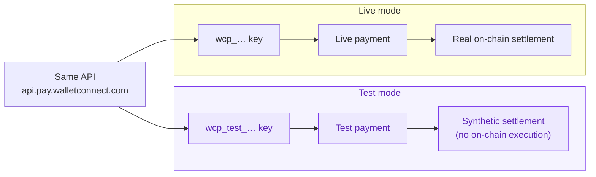

Every WalletConnect Pay account has two environments: **test** and **live**. Test mode lets you build and verify your full integration — merchants, settlement configuration, payments, and webhooks — without executing anything on-chain.

Throughout the docs and the dashboard, <span style={{color: "#7C3AED", fontWeight: 600}}>purple</span> indicates test mode.

## How test mode works

Test and live are separated at the **account level**, and you choose the environment by **which API key you use**. There is no `test` flag or mode parameter on any request — a payment created with a test key is a test payment, and a payment created with a live key is a live payment.



Both environments use the **same API, the same base URL, and the same endpoints**. Nothing about your code changes between test and live except the key.

| | Test mode | Live mode |
|---|---|---|
| **API key prefix** | `wcp_test_` | `wcp_` |
| **Base URL** | `https://api.pay.walletconnect.com` | `https://api.pay.walletconnect.com` |
| **On-chain execution** | None — settlement is simulated | Real transactions |
| **Transaction hash** | Synthetic (`test:{paymentId}`) | Real on-chain hash |
| **Webhooks** | Delivered | Delivered |
| **Data** | Fully separate from live data | Fully separate from test data |

## Test API keys

Test keys are created in the [dashboard](https://merchant.pay.walletconnect.com/en/api-keys), alongside live keys. You can tell them apart by the prefix: test keys always start with `wcp_test_`.

```bash
export WCP_API_KEY="wcp_test_…"      # test key — safe to experiment with
export WCP_BASE="https://api.pay.walletconnect.com"
```

Merchants, settlement configurations, and payments created with a test key exist only in your test environment. They are never visible to live requests, and vice versa.

<Warning>
API responses and webhook payloads do **not** include an environment field. The environment is determined entirely by the key that created the resource — if you need to tell test and live data apart in your systems, track which key produced it.
</Warning>

## What test payments do

A test payment moves through the same lifecycle as a live payment — created, processing, succeeded — so you can exercise your full integration, including status polling and webhook handling. The differences:

- **No funds move.** Nothing is executed on-chain and no settlement is delivered.
- **The transaction hash is synthetic.** Completed test payments report a `txId` of the form `test:{paymentId}` instead of a real on-chain hash.
- **Amounts are fixed.** The test environment returns fixed 1-unit payment options per token and chain, regardless of the amount you request. Don't assert on exact amounts in test mode.

Webhook events for test payments are delivered to your configured endpoints the same way live events are. Like API responses, events carry no environment marker — use a separate webhook endpoint for your test environment if you need to keep them apart.

## Going live

When your integration works end to end in test mode:

1. Create a **live key** in the [dashboard](https://merchant.pay.walletconnect.com/en/api-keys) (prefix `wcp_`).
2. Swap the key in your configuration — no code or endpoint changes needed.
3. Re-create your merchants and settlement configuration with the live key. Test-mode data does not carry over.

<Note>
During the pilot phase, live accounts may have a spending cap on payment volume. Test mode is not subject to any cap — build and verify as much as you need.
</Note>

## Next steps

<CardGroup cols={2}>
  <Card title="Quickstart" icon="rocket" href="/payments/merchant/quickstart">
    Create your first test payment in six steps.
  </Card>
  <Card title="Authentication" icon="key" href="/api-reference/authentication">
    How API keys and the Api-Key header work.
  </Card>
</CardGroup>
