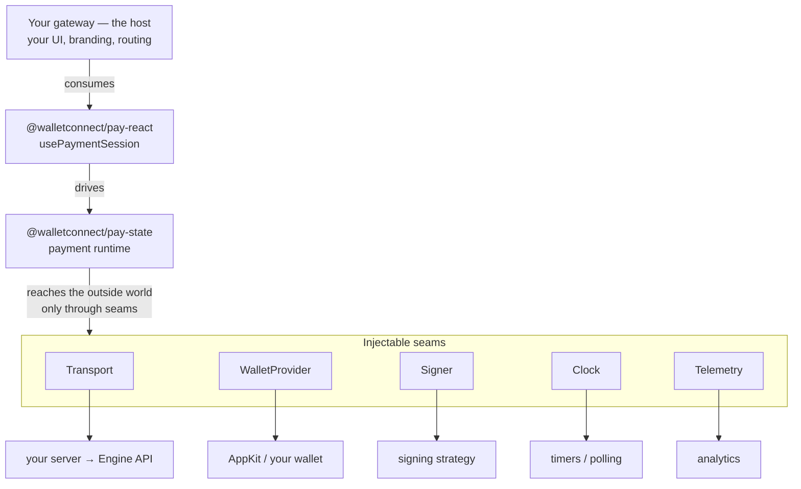
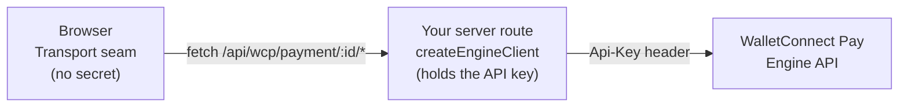

Before you install anything, it helps to understand the shape of the SDK: the stages a payment moves through, how the runtime plugs into your app, and why your Engine API key never reaches the browser.

## The payment lifecycle

Whatever UI you build, the runtime moves a payment through the same stages. Your job is to render each stage and call the matching action.

<Steps>
  <Step title="Load the payment" icon="link">
    The buyer arrives with a payment ID (from a QR code, link, or your checkout). The runtime fetches the payment intent — amount, merchant, accepted tokens.
  </Step>
  <Step title="Connect a wallet" icon="wallet">
    The buyer connects a wallet through the `WalletProvider` seam. The runtime reads their accounts across the supported networks.
  </Step>
  <Step title="Fetch payment options" icon="list">
    Given the connected accounts, the Engine returns the concrete ways to pay — token, network, amount, fees, and whether compliance data is required.
  </Step>
  <Step title="Select & build" icon="hammer">
    The buyer picks an option. The runtime builds the transaction(s) and the exact wallet-RPC actions to sign.
  </Step>
  <Step title="Sign" icon="signature">
    The `Signer` drives the wallet through the required signatures (e.g. a permit + the payment).
  </Step>
  <Step title="Confirm & settle" icon="check">
    Signed results are submitted to confirm the payment. The runtime then polls status until the payment succeeds, fails, or expires.
  </Step>
</Steps>

## How it fits together

The Headless SDK follows a **headless runtime + host** model. The payment flow lives entirely in the SDK; your application is the **host** that consumes it. The runtime reaches the outside world only through five injectable **seams** — so you can swap in your own transport, wallet, timing, and analytics, and reuse the exact same payment machine.

The five seams the runtime depends on:

| Seam             | What it abstracts                          | Provided by                                          |
| ---------------- | ------------------------------------------ | ---------------------------------------------------- |
| `Transport`      | Engine HTTP calls                          | `pay-core` `createHttpTransport` → your server route |
| `WalletProvider` | connect / accounts / provider / switch     | `pay-appkit`, or your own wallet integration         |
| `Signer`         | sign a payment option's wallet-RPC actions | `pay-state` signing strategies over the wallet seam  |
| `Clock`          | intervals + page visibility (for polling)  | browser timers (the SDK ships a default)             |
| `Telemetry`      | analytics breadcrumbs                      | your analytics pipeline (optional)                   |

<Note>
  `@walletconnect/pay-state` ships browser-ready `Clock` and `Telemetry` defaults (`browserClock`, `noopTelemetry`). In practice a React/Next.js gateway wires three seams itself — a `Transport` (pointed at your server route), a `WalletProvider` (the AppKit adapter), and a `Signer` (built from the wallet) — and reuses `browserClock` for the rest. `Telemetry` is optional.
</Note>

## The Engine API key never reaches the browser

WalletConnect Pay's Engine API is authenticated with a secret API key that **must stay server-side**. The SDK enforces this split: the browser talks to *your* server, and your server talks to the Engine.

`pay-core` exposes two entry points for exactly this: `createHttpTransport` for the browser (talks to *your* server) and `createEngineClient` (imported from `@walletconnect/pay-core/server`) which holds the API key and talks to the Engine. In a Next.js app, your Route Handler sits in the middle.

## Next steps

<CardGroup cols={2}>
  <Card title="Implementation" icon="code" href="/payments/psps/headless-sdk/implementation">
    Build a complete checkout in React / Next.js, step by step.
  </Card>
  <Card title="Packages Reference" icon="cube" href="/payments/psps/headless-sdk/packages-reference">
    The public API of pay-core, pay-state, pay-react, and pay-appkit.
  </Card>
</CardGroup>
