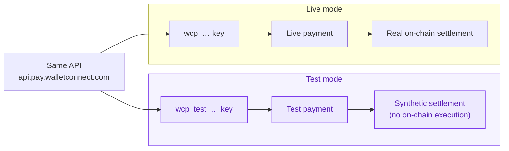
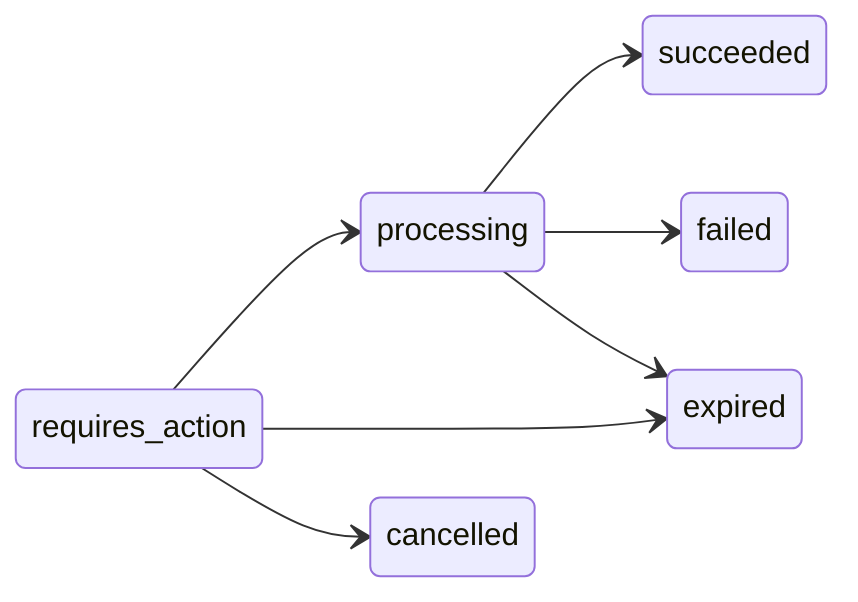

Every WalletConnect Pay account has two modes: **test** and **live**. Test mode lets you build and verify your full integration — merchants, settlement configuration, and payments — without executing anything on-chain.

Throughout these docs and on the hosted payment page, <span style={{color: "#7C3AED", fontWeight: 600}}>purple</span> indicates test mode. In the dashboard, the **Test / Live** selector at the top shows which mode you're working in.

## How test mode works

Test and live are separated at the **account level**, and you choose the mode by **which API key you use**. There is no `test` flag or mode parameter on any request — a payment created with a test key is a test payment, and a payment created with a live key is a live payment.



Both modes use the **same API, the same base URL, and the same endpoints**. Nothing about your code changes between test and live except the key.

| | Test mode | Live mode |
|---|---|---|
| **API key prefix** | `wcp_test_` | `wcp_` |
| **Base URL** | `https://api.pay.walletconnect.com` | `https://api.pay.walletconnect.com` |
| **On-chain execution** | None — settlement is simulated | Real transactions |
| **Transaction hash** | Synthetic (`test:{paymentId}`) | Real on-chain hash |
| **Payment limit** | None | Pilot limit until your account goes live |
| **Data** | Fully separate from live data | Fully separate from test data |

## Test API keys

Test keys are created in the [dashboard](https://merchant.pay.walletconnect.com/en/api-keys), alongside live keys. You can tell them apart by the prefix: test keys always start with `wcp_test_`.

```bash
export WCP_API_KEY="wcp_test_…"      # test key — safe to experiment with
export WCP_BASE="https://api.pay.walletconnect.com"
```

Merchants, settlement configurations, and payments created with a test key exist only in test mode. They are never visible to live requests, and vice versa.

<Warning>
API responses do **not** say whether a resource is test or live. The mode is determined entirely by the key that created the resource — if you need to tell test and live data apart in your systems, track which key produced it.
</Warning>

## What test payments do

A test payment moves through the same lifecycle as a live payment — created, processing, succeeded — so you can exercise your full integration, including status polling. The differences:

- **No funds move.** Nothing is executed on-chain and no settlement is delivered.
- **The transaction hash is synthetic.** Completed test payments report a `txId` of the form `test:{paymentId}` instead of a real on-chain hash.
- **Amounts are realistic.** Payment options are quoted from the amount you request, converted per token at current exchange rates — the same way live payments are priced.

## Test mode in the dashboard

You can run the whole test flow from the [dashboard](https://merchant.pay.walletconnect.com) without writing any code.

### Create a test payment

1. Switch the dashboard to **Test** with the selector in the top-right corner.
2. If you don't have any merchants in test mode yet, open **Merchants** and click **Create merchant** — give it a name and a contact email. Merchants are separate between test and live, so your live merchants don't appear in test.
3. Open **Payments** and click **Create payment**.
4. Select a merchant and enter any amount — test mode has no payment limit.
5. Click **Create payment**, then **Copy link** to share the payment link or open it yourself.

<Frame caption="Create payment in test mode (note the selector on Test, top right) — pick a merchant and enter any amount.">
  
</Frame>

### Simulate status changes

Test payments don't move through their lifecycle on their own — you drive them, from either of two places:

- **The hosted payment page** — open the generated payment link. In test mode the page shows a <span style={{color: "#7C3AED", fontWeight: 600}}>purple</span> banner ("You're in test mode. No real funds move.") and lets you pay with a simulated **Test Wallet**. A floating **Test Console** lets you simulate the transition: **Confirm success**, **Simulate failure**, **Expire payment**, or **Cancel payment**.
- **The dashboard payments list** — in test mode, each payment row has a **Simulation actions** menu (three dots): pick **Mark as [status]** to transition it.

<Columns cols={2}>
  <Frame caption="The hosted payment page in test mode — purple banner, Test Wallet, and the Test Console at the bottom.">
    
  </Frame>
  <Frame caption="The Test Console — available actions depend on the payment's current status.">
    
  </Frame>
</Columns>

<div style={{marginTop: "2rem"}}>
  <Frame caption="Simulation actions in the dashboard — a processing payment can be marked as succeeded, failed, or expired.">
    
  </Frame>
</div>

### Allowed status transitions

Whichever surface you use, a test payment can only move along these paths:



Terminal states (`succeeded`, `failed`, `expired`, `cancelled`) have no further actions. This lets you exercise every status your integration needs to handle — including the failure paths that are hard to produce on demand with real payments.

## The pilot limit

Test mode has no payment limit — build and verify as much as you need.

**Live mode** starts in **pilot**: live payments are real, but they count toward a total payment limit until your account is taken off pilot. In live mode, the dashboard home shows a **Pilot to Live** card with the limit you have left. When you're ready to process real volume, click **Request to go live** — our team reviews the request and removes the limit.

Switching from test to live is just a key swap: create a **live key** (prefix `wcp_`) in the [dashboard](https://merchant.pay.walletconnect.com/en/api-keys) and use it instead — same API, same endpoints, no code changes. Test-mode data does not carry over, so re-create your merchants and settlement configuration with the live key.

## Next steps

<CardGroup cols={2}>
  <Card title="Quickstart" icon="rocket" href="/payments/merchant/quickstart">
    Create your first test payment in six steps.
  </Card>
  <Card title="Authentication" icon="key" href="/payments/api-reference/authentication">
    How API keys and the Api-Key header work.
  </Card>
</CardGroup>
