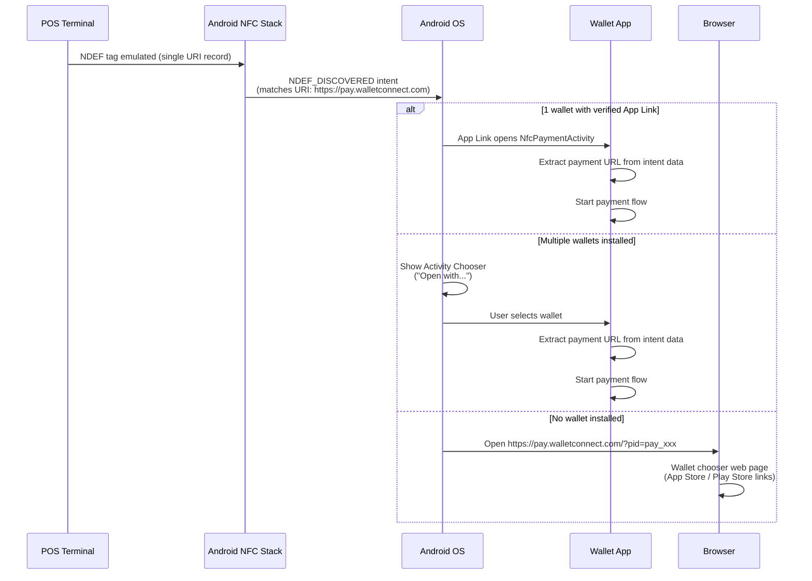
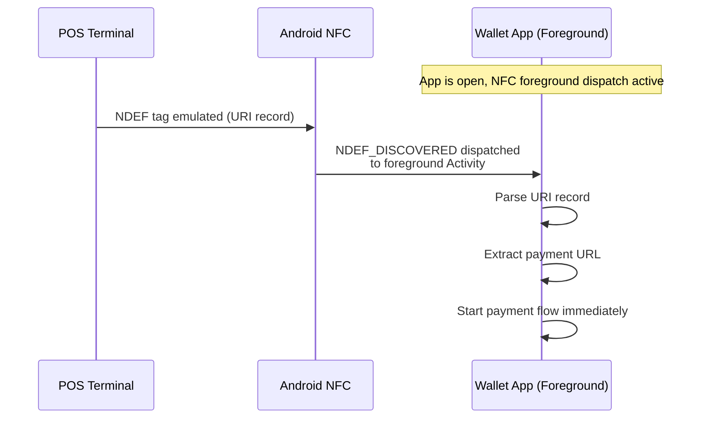
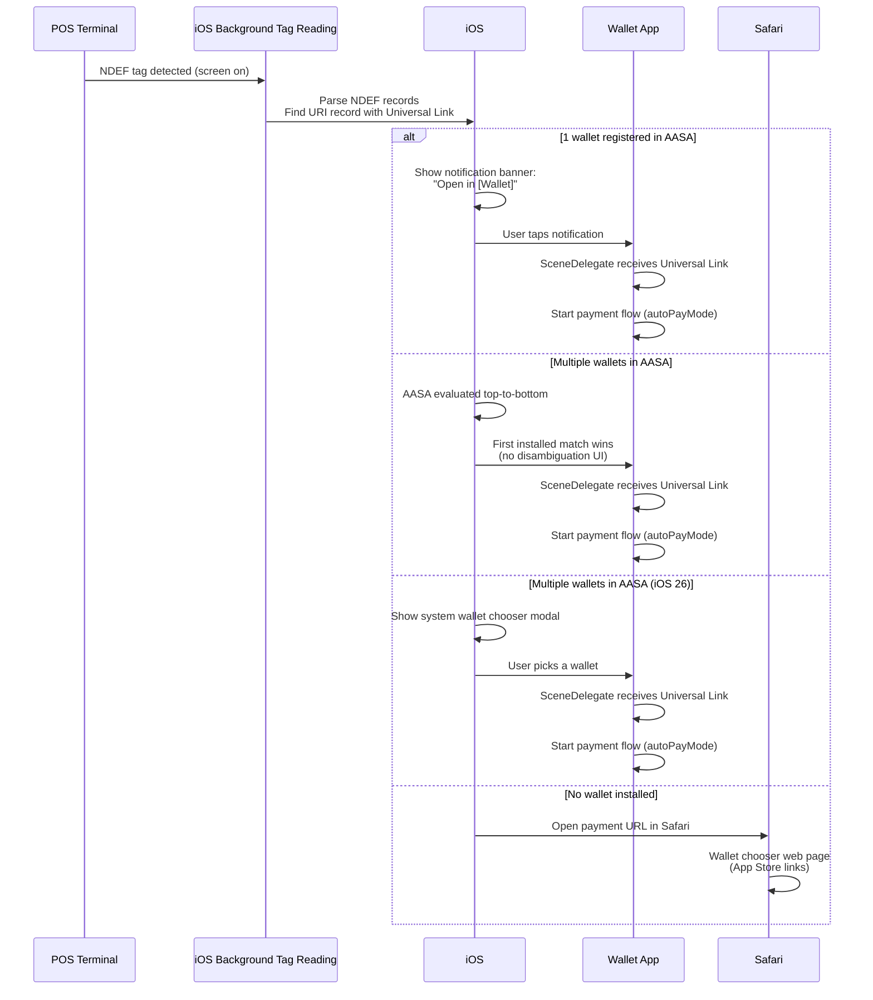
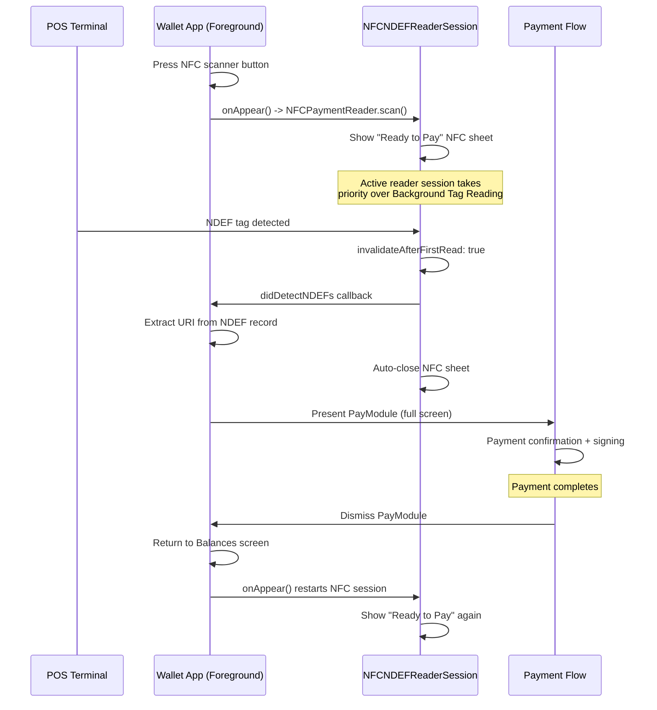

<Note>
Tap to Pay is an experimental feature. If you're interested in implementing and testing it in your wallet, please [contact us](mailto:support@reown.com) before getting started.
</Note>

This guide covers how to integrate Tap to Pay into a third-party wallet app on Android and iOS.

## Android

### How It Works

When a user taps their phone on a POS terminal, the terminal emits an NDEF tag with a single URI record pointing to `https://pay.walletconnect.com`. Android dispatches this in one of three ways:

- **One wallet installed with a verified App Link** — Android opens the wallet's `NfcPaymentActivity` directly.
- **Multiple wallets installed** — Android shows the "Open with..." chooser; user selects a wallet.
- **No wallet installed** — Android opens the URL in the browser, which shows a wallet chooser page with App Store / Play Store links.

When the wallet app is already in the foreground, foreground dispatch takes priority over manifest filters and delivers the intent directly.

#### Flow: Tap from Home Screen (Phone Unlocked, No App in Foreground)



#### Flow: Tap from Wallet App (Foreground)



### Integration Steps

<Steps>
  <Step title="Register with WalletConnect for App Links">
    Android App Links require `pay.walletconnect.com` to list your app in its `/.well-known/assetlinks.json` file. Without this, `autoVerify` intent filters won't pass verification.

    Provide the following to WalletConnect:
    - Package name
    - SHA-256 certificate fingerprint(s)
  </Step>

  <Step title="Manifest Setup">
    Add NFC permissions:

    ```xml AndroidManifest.xml
    <uses-feature
        android:name="android.hardware.nfc"
        android:required="false" />

    <uses-permission android:name="android.permission.NFC" />
    ```

    Register a translucent activity with three intent filters — each covers a different Android dispatch path for the same NFC tap:

    ```xml AndroidManifest.xml
    <activity
        android:name=".nfc.NfcPaymentActivity"
        android:exported="true"
        android:excludeFromRecents="true"
        android:taskAffinity=""
        android:theme="@style/Theme.YourWallet.Translucent">

        <!-- 1. NDEF_DISCOVERED: happy path.
             Android parsed the NDEF tag, matched the URI host,
             and launches this activity directly. -->
        <intent-filter>
            <action android:name="android.nfc.action.NDEF_DISCOVERED" />
            <category android:name="android.intent.category.DEFAULT" />
            <data android:scheme="https" android:host="pay.walletconnect.com" />
        </intent-filter>

        <!-- 2. TECH_DISCOVERED: fallback.
             Some POS hardware presents as ISO-DEP before Android parses NDEF.
             If NDEF_DISCOVERED didn't match, Android falls through to tech-based dispatch. -->
        <intent-filter>
            <action android:name="android.nfc.action.TECH_DISCOVERED" />
            <category android:name="android.intent.category.DEFAULT" />
        </intent-filter>
        <meta-data
            android:name="android.nfc.action.TECH_DISCOVERED"
            android:resource="@xml/nfc_tech_filter" />

        <!-- 3. App Links: non-NFC path.
             On some devices, Android opens the NDEF URL in the browser instead of
             direct dispatch. App Links auto-redirects here.
             Also covers QR code scans via browser.
             Requires registration in assetlinks.json (Step 1). -->
        <intent-filter android:autoVerify="true">
            <action android:name="android.intent.action.VIEW" />
            <category android:name="android.intent.category.DEFAULT" />
            <category android:name="android.intent.category.BROWSABLE" />
            <data android:scheme="https" android:host="pay.walletconnect.com" />
        </intent-filter>

    </activity>
    ```

    Create `res/xml/nfc_tech_filter.xml`:

    ```xml nfc_tech_filter.xml
    <resources>
        <tech-list>
            <tech>android.nfc.tech.IsoDep</tech>
            <tech>android.nfc.tech.Ndef</tech>
        </tech-list>
        <tech-list>
            <tech>android.nfc.tech.Ndef</tech>
        </tech-list>
        <tech-list>
            <tech>android.nfc.tech.NfcA</tech>
        </tech-list>
        <tech-list>
            <tech>android.nfc.tech.NfcB</tech>
        </tech-list>
    </resources>
    ```
  </Step>

  <Step title="Implement the NFC Interceptor Activity">
    The activity handles multiple intent paths to extract the payment URL:

    ```kotlin NfcPaymentActivity.kt
    class NfcPaymentActivity : AppCompatActivity() {

        override fun onCreate(savedInstanceState: Bundle?) {
            super.onCreate(savedInstanceState)
            val paymentUrl = extractPaymentUrl(intent)
            if (paymentUrl != null) openPaymentFlow(paymentUrl)
            finish()
        }

        override fun onNewIntent(intent: Intent) {
            super.onNewIntent(intent)
            val paymentUrl = extractPaymentUrl(intent) ?: return
            openPaymentFlow(paymentUrl)
            finish()
        }

        private fun openPaymentFlow(paymentUrl: String) {
            startActivity(
                Intent(this, YourMainWalletActivity::class.java).apply {
                    action = ACTION_NFC_PAYMENT
                    putExtra(EXTRA_PAYMENT_URL, paymentUrl)
                    addFlags(Intent.FLAG_ACTIVITY_NEW_TASK or Intent.FLAG_ACTIVITY_SINGLE_TOP)
                }
            )
        }

        private fun extractPaymentUrl(intent: Intent?): String? {
            if (intent == null) return null
            return when (intent.action) {
                // App Links — URL is in intent.data
                Intent.ACTION_VIEW ->
                    intent.data?.let { unwrapPaymentUrl(it.toString()) }
                // NDEF tag — URL is in NDEF extras
                NfcAdapter.ACTION_NDEF_DISCOVERED ->
                    extractFromNdefExtras(intent)
                // TECH fallback — read NDEF from Tag object
                NfcAdapter.ACTION_TECH_DISCOVERED ->
                    extractFromTag(intent) ?: extractFromNdefExtras(intent)
                else -> null
            }
        }
    }
    ```
  </Step>

  <Step title="Add Foreground Dispatch (wallet already open)">
    When the wallet activity is in the foreground, manifest intent filters may not fire. Use foreground dispatch to claim NFC priority:

    ```kotlin NfcPaymentReader.kt
    class NfcPaymentReader(
        private val activity: Activity,
        private val onPaymentUrl: (String) -> Unit,
    ) {
        private val nfcAdapter = NfcAdapter.getDefaultAdapter(activity)

        private val pendingIntent by lazy {
            PendingIntent.getActivity(
                activity, 0,
                Intent(activity, activity.javaClass)
                    .addFlags(Intent.FLAG_ACTIVITY_SINGLE_TOP),
                PendingIntent.FLAG_MUTABLE
            )
        }

        fun enable() {
            nfcAdapter?.enableForegroundDispatch(
                activity, pendingIntent,
                arrayOf(IntentFilter(NfcAdapter.ACTION_TECH_DISCOVERED)),
                arrayOf(
                    arrayOf(Ndef::class.java.name),
                    arrayOf(IsoDep::class.java.name)
                )
            )
        }

        fun disable() {
            nfcAdapter?.disableForegroundDispatch(activity)
        }

        /** Call from Activity.onNewIntent(). Returns true if handled. */
        fun handleIntent(intent: Intent): Boolean {
            // Same NDEF/Tag extraction logic as NfcPaymentActivity.
            // If a pay.walletconnect.com URL is found, call onPaymentUrl(url) and return true.
            // Otherwise return false.
        }
    }
    ```

    Wire it into your main activity:

    ```kotlin MainActivity.kt
    override fun onCreate(savedInstanceState: Bundle?) {
        super.onCreate(savedInstanceState)
        nfcReader = NfcPaymentReader(this) { url -> processPayment(url) }
    }

    override fun onResume() { super.onResume(); nfcReader.enable() }
    override fun onPause()  { super.onPause();  nfcReader.disable() }

    override fun onNewIntent(intent: Intent) {
        super.onNewIntent(intent)
        if (nfcReader.handleIntent(intent)) return
        // ...other intent handling
    }
    ```
  </Step>

  <Step title="Process Payment via WalletKit Pay">
    ```kotlin PaymentFlow.kt
    // 1. Fetch payment options
    val accounts = listOf("eip155:1:0xABC...", "eip155:137:0xABC...")
    val options = WalletKit.Pay.getPaymentOptions(paymentUrl, accounts).getOrThrow()

    // 2. Display options to user; user selects one

    // 3. Get required signing actions
    val actions = WalletKit.Pay.getRequiredPaymentActions(paymentId, optionId).getOrThrow()

    // 4. Sign each action
    val signatures = actions
        .filterIsInstance<Wallet.Model.RequiredAction.WalletRpc>()
        .map { rpc -> yourSigner.sign(rpc.action.method, rpc.action.params) }

    // 5. Confirm payment
    WalletKit.Pay.confirmPayment(
        Wallet.Params.ConfirmPayment(paymentId, optionId, signatures, collectedData)
    )
    ```
  </Step>
</Steps>

## iOS

### How It Works

When a user taps their phone on a POS terminal, iOS reads the NDEF tag automatically (Background Tag Reading, iOS 13+) and resolves the URL as a Universal Link. Depending on what's installed:

- **One wallet registered in AASA** — iOS shows a notification banner "Open in [Wallet]"; user taps to open.
- **Multiple wallets in AASA** — AASA is evaluated top-to-bottom; first installed match wins (no disambiguation UI). On iOS 26, a system wallet chooser modal is shown instead.
- **No wallet installed** — iOS opens the URL in Safari, which shows a wallet chooser page with App Store links.

When the wallet app is in the foreground, the app can trigger a manual NFC scan via `NFCNDEFReaderSession`, which takes priority over Background Tag Reading.

#### Flow: Tap from Home Screen (Phone Unlocked, No App in Foreground)



#### Flow: Tap from Wallet App (Foreground)



### Integration Steps

<Steps>
  <Step title="Register with WalletConnect for Universal Links">
    Universal Links require `pay.walletconnect.com` to host an Apple App Site Association (AASA) file listing your app. WalletConnect will add your app to `pay.walletconnect.com/.well-known/apple-app-site-association`.

    Provide:
    - Apple Team ID
    - Bundle ID
  </Step>

  <Step title="Entitlements">
    Add two entitlements in your `.entitlements` file.

    **Associated Domains** (for Universal Links / Background Tag Reading):

    ```xml Entitlements.plist
    <key>com.apple.developer.associated-domains</key>
    <array>
        <string>applinks:pay.walletconnect.com</string>
    </array>
    ```

    **NFC Tag Reading** (for manual CoreNFC scans):

    ```xml Entitlements.plist
    <key>com.apple.developer.nfc.readersession.formats</key>
    <array>
        <string>TAG</string>
    </array>
    ```

    Also enable these capabilities in **Xcode → Target → Signing & Capabilities**:
    - Associated Domains
    - Near Field Communication Tag Reading
  </Step>

  <Step title="Info.plist">
    Add the NFC usage description (required by Apple for CoreNFC):

    ```xml Info.plist
    <key>NFCReaderUsageDescription</key>
    <string>This app reads NFC tags to receive payment links from POS terminals.</string>
    ```
  </Step>

  <Step title="Implement the NFC Reader (manual scan path)">
    This handles the case where the user taps an NFC button inside the app to initiate a read:

    ```swift NFCPaymentReader.swift
    import CoreNFC

    final class NFCPaymentReader: NSObject {

        static let shared = NFCPaymentReader()
        static var isAvailable: Bool { NFCNDEFReaderSession.readingAvailable }

        private var session: NFCNDEFReaderSession?
        private var completion: ((Result<String, Error>) -> Void)?

        func scan(completion: @escaping (Result<String, Error>) -> Void) {
            guard NFCNDEFReaderSession.readingAvailable else {
                completion(.failure(NFCPaymentError.notAvailable))
                return
            }

            self.completion = completion
            session = NFCNDEFReaderSession(
                delegate: self,
                queue: .main,
                invalidateAfterFirstRead: true  // auto-dismiss after first tag
            )
            session?.alertMessage = "Ready to Pay"
            session?.begin()
        }
    }

    extension NFCPaymentReader: NFCNDEFReaderSessionDelegate {

        func readerSessionDidBecomeActive(_ session: NFCNDEFReaderSession) {}

        func readerSession(_ session: NFCNDEFReaderSession, didDetectNDEFs messages: [NFCNDEFMessage]) {
            for message in messages {
                for record in message.records {
                    if let url = record.wellKnownTypeURIPayload() {
                        session.alertMessage = "Payment link received!"
                        session.invalidate()
                        completion?(.success(url.absoluteString))
                        completion = nil
                        return
                    }
                }
            }
            session.invalidate(errorMessage: "No payment link found on this NFC tag.")
            completion?(.failure(NFCPaymentError.noPaymentLink))
            completion = nil
        }

        func readerSession(_ session: NFCNDEFReaderSession, didInvalidateWithError error: Error) {
            if let nfcError = error as? NFCReaderError,
               nfcError.code == .readerSessionInvalidationErrorFirstNDEFTagRead ||
               nfcError.code == .readerSessionInvalidationErrorUserCanceled {
                if nfcError.code == .readerSessionInvalidationErrorUserCanceled {
                    completion?(.failure(NFCPaymentError.cancelled))
                    completion = nil
                }
                return
            }
            completion?(.failure(error))
            completion = nil
        }
    }

    enum NFCPaymentError: LocalizedError {
        case notAvailable
        case noPaymentLink
        case cancelled

        var errorDescription: String? {
            switch self {
            case .notAvailable:  return "NFC is not available on this device."
            case .noPaymentLink: return "No payment link found on the NFC tag."
            case .cancelled:     return "NFC scan cancelled."
            }
        }
    }
    ```

    Key points:
    - `invalidateAfterFirstRead: true` — iOS dismisses the NFC sheet after one tag is read.
    - `wellKnownTypeURIPayload()` — extracts the URI from a standard NDEF URI record (what the POS emits).
    - `.readerSessionInvalidationErrorFirstNDEFTagRead` — normal completion, not an error.
  </Step>

  <Step title="Handle Background Tag Reading (Universal Links)">
    This is the zero-interaction path. The user holds their phone near the POS terminal — even from the lock screen or home screen — and iOS reads the NDEF tag automatically, resolves the URL as a Universal Link, and opens your app.

    The URL arrives via `NSUserActivity` in your `SceneDelegate`:

    ```swift SceneDelegate.swift
    func scene(_ scene: UIScene, continue userActivity: NSUserActivity) {
        guard let url = userActivity.webpageURL else { return }

        let urlString = url.absoluteString
        if WalletKit.isPaymentLink(urlString) {
            showPaymentFlow(paymentLink: urlString)
            return
        }

        // ...handle other Universal Links
    }
    ```

    For **cold start** (app was not running), Universal Links arrive in `connectionOptions.userActivities`:

    ```swift SceneDelegate.swift
    func scene(_ scene: UIScene, willConnectTo session: UISceneSession,
               options connectionOptions: UIScene.ConnectionOptions) {
        // ...window setup...

        // Check for payment Universal Link on cold start
        if let url = connectionOptions.userActivities
               .first(where: { $0.activityType == NSUserActivityTypeBrowsingWeb })?
               .webpageURL,
           WalletKit.isPaymentLink(url.absoluteString) {
            // Delay slightly to let the UI finish loading
            DispatchQueue.main.asyncAfter(deadline: .now() + 0.5) {
                self.showPaymentFlow(paymentLink: url.absoluteString)
            }
        }
    }
    ```
  </Step>

  <Step title="Wire the NFC Button in Your UI">
    Show an NFC scan button only on devices that support it:

    ```swift NFCScanView.swift
    // SwiftUI
    if NFCPaymentReader.isAvailable {
        Button(action: { startNfcScan() }) {
            Image(systemName: "wave.3.right")
        }
    }

    func startNfcScan() {
        NFCPaymentReader.shared.scan { result in
            switch result {
            case .success(let urlString):
                if WalletKit.isPaymentLink(urlString) {
                    showPaymentFlow(paymentLink: urlString)
                }
            case .failure(let error):
                if case NFCPaymentError.cancelled = error { return }
                showError(error)
            }
        }
    }
    ```
  </Step>

  <Step title="Process Payment via WalletKit Pay">
    ```swift PaymentFlow.swift
    // 1. Fetch payment options
    let accounts = ["eip155:1:0xABC...", "eip155:137:0xABC..."]
    let options = try await WalletKit.instance.Pay.getPaymentOptions(
        paymentLink: paymentUrl,
        accounts: accounts
    )

    // 2. Show options UI — user selects one

    // 3. Get required signing actions
    let actions = try await WalletKit.instance.Pay.getRequiredPaymentActions(
        paymentId: options.paymentId,
        optionId: selectedOption.id
    )

    // 4. Sign each action (typically eth_signTypedData_v4)
    let signatures = try actions.map { action in
        try yourSigner.sign(method: action.method, params: action.params)
    }

    // 5. Confirm payment
    let result = try await WalletKit.instance.Pay.confirmPayment(
        paymentId: options.paymentId,
        optionId: selectedOption.id,
        signatures: signatures
    )
    ```
  </Step>
</Steps>
