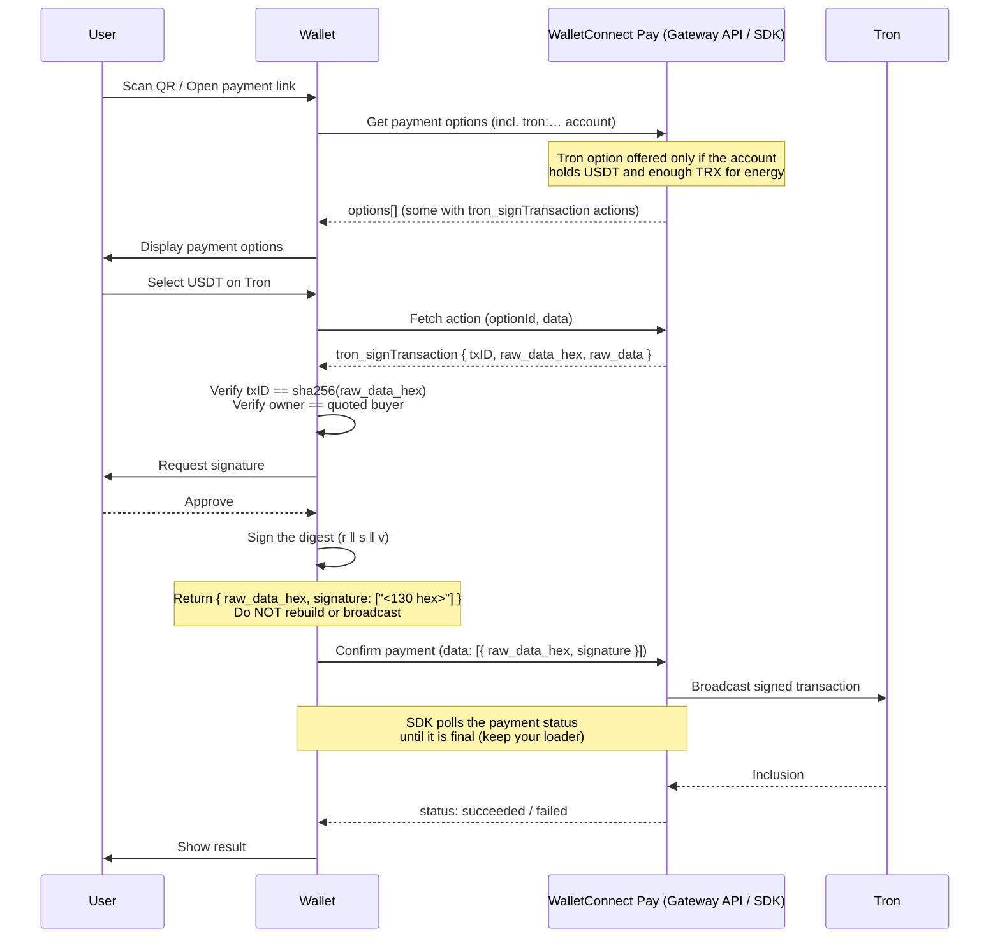

WalletConnect Pay supports Tron payments with USDT (TRC-20). Tron is a **sign-only relay** chain: WalletConnect Pay builds the transaction, commits to its `txID`, and broadcasts the signed bytes itself. Your wallet only verifies what it was given and signs it — it never rebuilds, re-serializes, or submits the transaction.

<Info>
This guide applies whether you integrate with the **Wallet Pay SDK** or directly with the **Gateway API** ([API-first](/payments/wallets/api-first)). The signing requirements are identical — Tron actions arrive as `walletRpc` actions, and the signed result is returned in the results array. The code samples below use SDK method names; if you are integrating API-first, the equivalents are:

| SDK | Gateway API |
|-----|-------------|
| `getPaymentOptions({ accounts })` | `POST /v1/gateway/payment/{id}/options` with `accounts[]` |
| `option.actions` / `getRequiredPaymentActions` | the option's `actions[]`, resolved via `POST /v1/gateway/payment/{id}/fetch` when an action is type `build` |
| `confirmPayment(data)` | `POST /v1/gateway/payment/{id}/confirm` with `results[]` |

Everything else in this guide — advertising Tron accounts, routing by namespace, the `tron_signTransaction` payload, and returning the `{ raw_data_hex, signature }` object — is the same in both integrations.
</Info>

## Requirements

Object results in `data` require these minimum SDK versions:

| Platform | Package | Minimum version |
|----------|---------|-----------------|
| Kotlin | `com.reown:walletkit` / `com.walletconnect:pay` | 1.9.0 / 1.3.0 |
| Swift | reown-swift (`WalletConnectPay` / `ReownWalletKit`) | 2.4.0 |
| Flutter | `reown_walletkit` / `walletconnect_pay` | 1.5.1 / 1.1.0 |
| React Native | `@reown/walletkit` / `@walletconnect/pay` / `@walletconnect/react-native-compat` | 1.6.0 / 1.1.0 / 2.25.0 |
| Web | `@reown/walletkit` / `@walletconnect/pay` | 1.6.0 / 1.1.0 |

Earlier versions type the confirm results as strings only and cannot carry the Tron result object.

## Tron payment flow

A Tron payment follows the same three-call flow as any other WalletConnect Pay payment. The Tron-specific parts are the signing method (`tron_signTransaction`), the verification your wallet performs before signing, the **object** it returns, and the asynchronous settlement.



<Warning>
The `data[]` you submit on confirm must match the option's `actions[]` in **order and length**. The Tron result is a single JSON object — do not wrap it in an extra array and do not stringify it into a plain signature string.
</Warning>

## Key differences from other chains

1. **Sign-only relay** — `raw_data_hex` is opaque. Refreshing the expiration, re-deriving the TAPOS reference block, adjusting `fee_limit`, or re-encoding `raw_data` all change the hash and get the payment rejected with `tx_id_mismatch`.
2. **Object result** — the confirm result is `{ raw_data_hex, signature }`, not a bare signature string. This is why `confirmPayment` takes `data` rather than `signatures`.
3. **The buyer pays energy** — there is no fee payer and no fee bump on Tron. WalletConnect Pay offers a Tron option only to accounts holding USDT **and** enough TRX for energy (currently 14 TRX). An unfunded account is not offered Tron at all.
4. **Mainnet only** — WalletConnect Pay settles Tron on mainnet (`tron:0x2b6653dc`).
5. **Settlement takes a few seconds** — the gateway broadcasts the transaction and waits for inclusion. `confirmPayment` keeps polling and resolves with `succeeded` or `failed`, exactly as on other chains; nothing extra to handle.

## Implementation requirements

### Advertise Tron accounts

Include the wallet's Tron **mainnet** account when calling `getPaymentOptions`, using the CAIP-10 format:

```
tron:0x2b6653dc:<base58Address>
```

For example:

```
tron:0x2b6653dc:TNCwFenyM9VExurrWMPrjq1Jd6qUTmSuL3
```

<Tabs>
<Tab title="TypeScript">
```typescript accounts.ts
const evmAccounts = evmChains.map(
  (chain) => `eip155:${chain.id}:${evmAddress}`
);
const tronAccounts = tronAddress ? [`tron:0x2b6653dc:${tronAddress}`] : [];

const options = await pay.getPaymentOptions({
  paymentLink,
  accounts: [...evmAccounts, ...tronAccounts],
});
```
</Tab>
<Tab title="Kotlin">
```kotlin Accounts.kt
val evmAccounts = evmChains.map { chain -> "eip155:${chain.id}:$evmAddress" }
val tronAccounts = tronAddress?.let { listOf("tron:0x2b6653dc:$it") } ?: emptyList()

val options = WalletKit.Pay.getPaymentOptions(
    Wallet.Params.PaymentOptions(
        paymentLink = paymentLink,
        accounts = evmAccounts + tronAccounts
    )
)
```
</Tab>
<Tab title="Swift">
```swift Accounts.swift
let evmAccounts = evmChains.map { chain in "eip155:\(chain.id):\(evmAddress)" }
let tronAccounts = tronAddress.map { ["tron:0x2b6653dc:\($0)"] } ?? []

let options = try await WalletKit.instance.Pay.getPaymentOptions(
    paymentLink: paymentLink,
    accounts: evmAccounts + tronAccounts
)
```
</Tab>
</Tabs>

<Note>
Only advertise a Tron account if your wallet holds Tron keys. The gateway checks the account's USDT and TRX balances and omits the Tron option when either is insufficient — this is expected, not an integration error.
</Note>

### Route actions by namespace

Extract the namespace from `actions[i].walletRpc.chainId` and route `tron` actions to the Tron signer:

<Tabs>
<Tab title="TypeScript">
```typescript routeActions.ts
for (const action of actions) {
  const namespace = action.walletRpc.chainId.split(':')[0];

  switch (namespace) {
    case 'eip155':
      data.push(await handleEvmAction(action));
      break;
    case 'solana':
      data.push(await handleSolanaAction(action));
      break;
    case 'tron':
      data.push(handleTronAction(action)); // returns an object, see below
      break;
    default:
      throw new Error(`Unsupported namespace: ${namespace}`);
  }
}
```
</Tab>
<Tab title="Kotlin">
```kotlin RouteActions.kt
for (action in actions) {
    val namespace = action.walletRpc.chainId.split(':')[0]

    data += when (namespace) {
        "eip155" -> handleEvmAction(action)
        "solana" -> handleSolanaAction(action)
        "tron" -> handleTronAction(action) // JSON-encoded object, see below
        else -> error("Unsupported namespace: $namespace")
    }
}
```
</Tab>
<Tab title="Swift">
```swift RouteActions.swift
for action in actions {
    let namespace = action.walletRpc.chainId.split(separator: ":").first.map(String.init) ?? ""

    switch namespace {
    case "eip155":
        data.append(try await handleEvmAction(action))
    case "solana":
        data.append(try await handleSolanaAction(action))
    case "tron":
        data.append(try handleTronAction(action)) // JSON-encoded object, see below
    default:
        throw PaymentError.unsupportedNamespace(namespace)
    }
}
```
</Tab>
</Tabs>

### Parse the `tron_signTransaction` action

The action's `params` is a JSON string. It may be array-wrapped, and the transaction may be nested once more under `transaction` — accept both shapes, exactly as the WalletConnect Sign `tron_signTransaction` request handler does:

```json params.json
[
  {
    "transaction": {
      "txID": "d2a9…",
      "raw_data_hex": "0a02…",
      "raw_data": { "contract": [{ "parameter": { "value": { "owner_address": "41…" } } }] },
      "visible": false
    }
  }
]
```

```typescript parseTronAction.ts
const parsed = JSON.parse(action.walletRpc.params);
const request = Array.isArray(parsed) ? parsed[0] : parsed;
// `transaction` is either the transaction itself or `{ transaction }`
const transaction = request?.transaction?.transaction ?? request?.transaction;
if (!transaction?.raw_data_hex || !transaction?.txID) {
  throw new Error('Missing transaction in Tron payment action params');
}
```

### Verify before signing

Verify the payload before asking the user to approve, so a bad payload surfaces as a readable wallet-side error instead of an opaque gateway rejection at confirm:

1. **`txID` must equal `sha256(raw_data_hex)`** — anything else means the bytes were altered and the gateway would reject the payment with `tx_id_mismatch`.
2. **The transaction owner must be the quoted buyer** — `raw_data.contract[0].parameter.value.owner_address` must match the account the option was quoted against, or the gateway rejects with `owner_mismatch`.

### Sign the digest verbatim

Sign `sha256(raw_data_hex)` with the account's secp256k1 key and return the 65-byte recoverable signature (`r ‖ s ‖ v`) as 130 hex characters. Do **not** pass the transaction through a helper that re-serializes `raw_data` from JSON (such as TronWeb's `trx.sign`) — it can change the bytes and therefore the hash.

<Tabs>
<Tab title="TypeScript">
```typescript handleTronAction.ts
import { TronWeb, utils } from 'tronweb';

interface TronUnsignedTransaction {
  txID: string;
  raw_data_hex: string;
  raw_data?: Record<string, any>;
}

// A type alias (not an interface) so it is assignable to the Pay SDK's
// `data` element type without a cast.
type TronSignedTransaction = { raw_data_hex: string; signature: string[] };

function signTronPayment(
  tx: TronUnsignedTransaction,
  privateKeyHex: string,
  walletAddress: string
): TronSignedTransaction {
  // 1. txID must be sha256(raw_data_hex)
  const digest = utils.crypto.SHA256(utils.code.hexStr2byteArray(tx.raw_data_hex));
  const computedTxID = utils.bytes.byteArray2hexStr(digest).toLowerCase();
  if (computedTxID !== tx.txID.replace(/^0x/, '').toLowerCase()) {
    throw new Error(`Tron txID mismatch: expected ${computedTxID}, got ${tx.txID}`);
  }

  // 2. The transaction must spend from the quoted buyer
  const owner = tx.raw_data?.contract?.[0]?.parameter?.value?.owner_address;
  if (owner && TronWeb.address.toHex(owner) !== TronWeb.address.toHex(walletAddress)) {
    throw new Error('Tron transaction owner does not match the wallet account');
  }

  // 3. Sign the digest — 65-byte recoverable signature as 130 hex chars
  const signature = utils.crypto.ECKeySign(
    digest,
    utils.code.hexStr2byteArray(privateKeyHex.replace(/^0x/, ''))
  );

  return { raw_data_hex: tx.raw_data_hex, signature: [signature] };
}
```
</Tab>
<Tab title="Kotlin">
```kotlin HandleTronAction.kt
// 1. txID must be sha256(raw_data_hex)
val digest = MessageDigest.getInstance("SHA-256").digest(rawDataHex.hexToByteArray())
require(digest.toHexString() == txId.removePrefix("0x").lowercase()) {
    "Tron txID mismatch"
}

// 2. The transaction must spend from the quoted buyer
val owner = rawData?.optJSONArray("contract")?.optJSONObject(0)
    ?.optJSONObject("parameter")?.optJSONObject("value")?.optString("owner_address")
require(owner == null || tronWallet.ownsAddress(owner)) { "Tron transaction owner mismatch" }

// 3. Sign the digest — a 65-byte recoverable secp256k1 signature (r ‖ s ‖ v) as 130 hex chars.
//    Use your wallet's Tron signer (Yttrium utils ship a Tron transaction signer as well).
val signatureHex = tronWallet.signDigest(digest)

// The Pay SDK takes `data` elements as strings; a JSON-encoded object is
// sent to the gateway as an object.
val tronResult = JSONObject().apply {
    put("raw_data_hex", rawDataHex)
    put("signature", JSONArray().put(signatureHex))
}.toString()
```
</Tab>
<Tab title="Swift">
```swift HandleTronAction.swift
// 1. txID must be sha256(raw_data_hex)
let digest = SHA256.hash(data: Data(hex: rawDataHex))
guard digest.hexString == txId.removingPrefix("0x").lowercased() else {
    throw PaymentError.tronTxIdMismatch
}

// 2. The transaction must spend from the quoted buyer
if let owner = rawData?.contract?.first?.parameter?.value?.ownerAddress,
   !tronWallet.owns(address: owner) {
    throw PaymentError.tronOwnerMismatch
}

// 3. Sign the digest — a 65-byte recoverable secp256k1 signature (r ‖ s ‖ v) as 130 hex chars.
let signatureHex = try tronWallet.signDigest(digest)

// The Pay SDK takes `data` elements as strings; a JSON-encoded object is
// sent to the gateway as an object.
let tronResult = try JSONSerialization.data(
    withJSONObject: ["raw_data_hex": rawDataHex, "signature": [signatureHex]]
)
data.append(String(decoding: tronResult, as: UTF8.self))
```
</Tab>
<Tab title="Dart">
```dart handle_tron_action.dart
// Verify txID == sha256(raw_data_hex) and the owner before signing (see above),
// then sign the digest and return the result as a JSON object.
final tronResult = <String, dynamic>{
  'raw_data_hex': rawDataHex,
  'signature': [signatureHex], // 130 hex chars, r ‖ s ‖ v
};

final request = ConfirmPaymentRequest(
  paymentId: paymentId,
  optionId: optionId,
  data: [tronResult], // List<Object>: Strings or Map<String, dynamic>
);
```
</Tab>
</Tabs>

<Warning>
**Return the object, not a bare signature.** The gateway needs both `raw_data_hex` and `signature` to broadcast. On React Native and Web pass the object directly; on Kotlin and Swift pass it JSON-encoded as a string — the SDK detects JSON objects in `data` and forwards them as objects.
</Warning>

### Do not broadcast

Do not implement `tron_sendTransaction` for Pay flows and do not call `sendRawTransaction`. WalletConnect Pay broadcasts the signed transaction; a wallet that also broadcasts causes a duplicate submission.

## Complete action handler

<Tabs>
<Tab title="TypeScript">
```typescript approvePayment.ts
import type { ConfirmPaymentParams } from '@walletconnect/pay';

async function approvePayment(actions: Action[]): Promise<NonNullable<ConfirmPaymentParams['data']>> {
  // Plain strings for EVM/Solana results, a JSON object for Tron — in action order
  const data: NonNullable<ConfirmPaymentParams['data']> = [];

  for (const action of actions) {
    const { chainId, method, params } = action.walletRpc;
    const namespace = chainId.split(':')[0];

    switch (namespace) {
      case 'eip155':
        data.push(await handleEvmAction(method, chainId, params));
        break;
      case 'solana':
        data.push(await handleSolanaAction(method, params));
        break;
      case 'tron': {
        if (method !== 'tron_signTransaction') {
          throw new Error(`Unsupported Tron method: ${method}`);
        }
        const parsed = JSON.parse(params);
        const request = Array.isArray(parsed) ? parsed[0] : parsed;
        const transaction = request?.transaction?.transaction ?? request?.transaction;
        data.push(signTronPayment(transaction, tronPrivateKey, tronAddress));
        break;
      }
      default:
        throw new Error(`Unsupported namespace: ${namespace}`);
    }
  }

  return data;
}

const result = await pay.confirmPayment({ paymentId, optionId, data });
```
</Tab>
</Tabs>

## Validate your integration

<Steps>
<Step title="Funded Tron account">
Import a mainnet account holding USDT and at least 14 TRX. Open a payment link whose merchant accepts USDT on Tron and verify that:
- The Tron option is presented
- The wallet verifies `txID` and the owner, then signs
- The confirm request carries `{ raw_data_hex, signature }` as an object in `data`
- `confirmPayment` resolves with `succeeded` and the transaction appears in a Tron explorer
</Step>

<Step title="Tampered payload">
Alter one byte of `raw_data_hex` in a test harness and verify the wallet fails with a `txID` mismatch **before** signing, rather than at confirm.
</Step>

<Step title="Regression on other chains">
Confirm that EVM and Solana payments still work — their results stay plain strings in the same `data` array.
</Step>
</Steps>

## Sample implementations

<CardGroup cols={2}>
  <Card title="React Native" icon="github" href="https://github.com/reown-com/react-native-examples/tree/main/wallets/rn_cli_wallet">
    `wallets/rn_cli_wallet` — see `TronLib.signPaymentTransaction` for the verification and signing, `PaymentStore.approvePayment` for the `tron` route, and `usePairing` for advertising the Tron mainnet account.
  </Card>
  <Card title="Web" icon="github" href="https://github.com/reown-com/web-examples/tree/main/advanced/wallets/react-wallet-v2">
    `advanced/wallets/react-wallet-v2` — see `TronLib.signPaymentTransaction` and the `tron_signTransaction` branch in `PaymentStore`.
  </Card>
</CardGroup>
