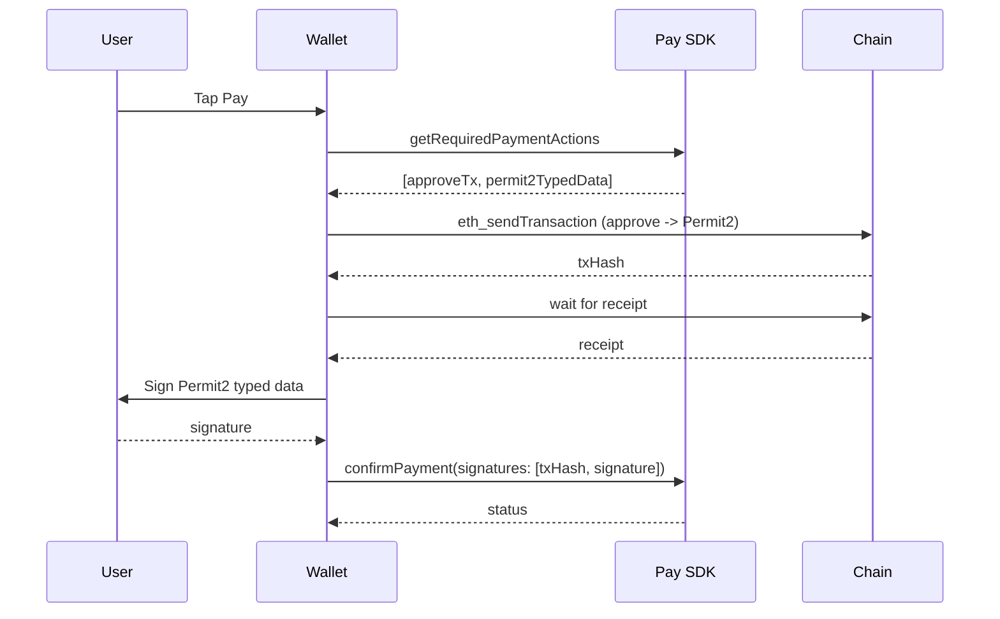

The simple WalletConnect Pay flow signs an EIP-3009 `transferWithAuthorization` typed-data payload — the gasless transfer used by USDC and similar stablecoins. USDT does not implement EIP-3009, so WalletConnect Pay routes it through the [Permit2](https://github.com/Uniswap/permit2) contract instead.

The first time a user pays a given token on a given chain, the wallet must approve Permit2 on-chain. Subsequent payments on the same token only require the typed-data signature.

## The two-action flow

When an option needs a Permit2 approval, `getRequiredPaymentActions` returns **two** actions — in the order they must execute:

1. `eth_sendTransaction` — ERC-20 `approve(Permit2, amount)` on the token contract
2. `eth_signTypedData_v4` — Permit2 typed-data payload authorizing the transfer



<Warning>
`signatures[]` passed to `confirmPayment` must match `actions[]` in **order and length** — the approve tx hash first, then the Permit2 signature.
</Warning>

## Detecting an approval-required option

Inspect the action list for an `eth_sendTransaction` entry. In standalone SDK flows, this means `option.actions`; in WalletKit flows, this means the actions returned by `getRequiredPaymentActions`. If one is present, the option is a Permit2 flow and your wallet should prepare for an on-chain step.

<Tabs>
<Tab title="Kotlin">
```kotlin
// WalletKit: inspect the actions returned by getRequiredPaymentActions
fun requiresApproval(requiredActions: List<Wallet.Model.RequiredAction>?): Boolean =
    requiredActions
        ?.filterIsInstance<Wallet.Model.RequiredAction.WalletRpc>()
        ?.any { it.action.method == "eth_sendTransaction" }
        ?: false
```
</Tab>
<Tab title="Swift">
```swift
func requiresApproval(_ actions: [Action]?) -> Bool {
    actions?.contains { $0.walletRpc.method == "eth_sendTransaction" } ?? false
}
```
</Tab>
<Tab title="TypeScript">
```typescript
function requiresApproval(actions: readonly Action[] | null): boolean {
  return !!actions?.some(a => a.walletRpc?.method === "eth_sendTransaction");
}
```
</Tab>
<Tab title="Dart">
```dart
bool requiresApproval(List<Action>? actions) =>
    actions?.any((a) => a.walletRpc.method == 'eth_sendTransaction') ?? false;
```
</Tab>
</Tabs>

## Showing the approval gas estimate

The approve tx costs native gas (e.g. POL on Polygon, ETH on mainnet) — separate from the token amount the user is paying. Estimate it and show the user the expected fee before they confirm so they aren't surprised by a wallet prompt for a one-time on-chain cost.

This can live wherever your wallet collects user intent — a review screen, a confirmation sheet, or inline on the option row.

<Tabs>
<Tab title="Kotlin">
```kotlin
suspend fun estimateApprovalFee(
    chainId: String,
    txParams: JSONObject,
): BigInteger? = runCatching {
    val gasLimit = rpcEstimateGas(chainId, txParams)
    val maxFeePerGas = fetchFeeData(chainId).maxFeePerGas
    gasLimit.multiply(maxFeePerGas)
}.getOrNull()
```
</Tab>
<Tab title="Swift">
```swift
func estimateApprovalFee(
    chainId: String,
    txParams: [String: Any]
) async -> BigUInt? {
    do {
        let gasLimit = try await rpc.estimateGas(chainId: chainId, tx: txParams)
        let maxFeePerGas = try await rpc.maxFeePerGas(chainId: chainId)
        return gasLimit * maxFeePerGas
    } catch {
        return nil
    }
}
```
</Tab>
<Tab title="TypeScript">
```typescript
async function estimateApprovalFee(
  provider: providers.JsonRpcProvider,
  tx: providers.TransactionRequest,
): Promise<BigNumber | null> {
  try {
    const [gasLimit, feeData] = await Promise.all([
      provider.estimateGas(tx),
      provider.getFeeData(),
    ]);
    return feeData.maxFeePerGas ? gasLimit.mul(feeData.maxFeePerGas) : null;
  } catch {
    return null;
  }
}
```
</Tab>
<Tab title="Dart">
```dart
Future<BigInt?> estimateApprovalFee(Map<String, dynamic> txParams) async {
  try {
    final gasLimit = await ethClient.estimateGas(/* tx params */);
    final fees = await ethClient.getFeeData();
    return gasLimit * fees.maxFeePerGas.getInWei;
  } catch (_) {
    return null;
  }
}
```
</Tab>
</Tabs>

<Tip>
If estimation fails (RPC error, missing fields, etc.), don't block the flow. Fall back to a generic message such as "Network fee set by wallet" — the wallet's signing prompt will still surface the actual cost when the user confirms.
</Tip>

## Executing the actions in order

Because the Permit2 typed data signs against the token allowance the approve tx grants, the **approve must be mined before you sign**.

1. Submit `eth_sendTransaction` (action 1) and wait for the receipt.
2. Parse the typed data from `eth_signTypedData_v4` (action 2) and sign it.
3. Push both results into `signatures[]` in the order the actions were returned.
4. Call `confirmPayment(signatures)`.

<Tabs>
<Tab title="Kotlin">
```kotlin
val signatures = mutableListOf<String>()

for (action in actions.filterIsInstance<Wallet.Model.RequiredAction.WalletRpc>()) {
    signatures += when (action.action.method) {
        "eth_sendTransaction" -> {
            val txHash = wallet.sendTransaction(action.action.chainId, action.action.params)
            wallet.awaitReceipt(action.action.chainId, txHash)
            txHash
        }
        "eth_signTypedData_v4" ->
            wallet.signTypedData(action.action.chainId, action.action.params)
        else -> error("Unsupported method: ${action.action.method}")
    }
}
```
</Tab>
<Tab title="Swift">
```swift
var signatures: [String] = []

for action in actions {
    let rpc = action.walletRpc
    let result: String
    switch rpc.method {
    case "eth_sendTransaction":
        let txHash = try await wallet.sendTransaction(chainId: rpc.chainId, params: rpc.params)
        try await wallet.awaitReceipt(chainId: rpc.chainId, txHash: txHash)
        result = txHash
    case "eth_signTypedData_v4":
        result = try await wallet.signTypedData(chainId: rpc.chainId, params: rpc.params)
    default:
        throw PaymentError.unsupportedMethod(rpc.method)
    }
    signatures.append(result)
}
```
</Tab>
<Tab title="TypeScript">
```typescript
const signatures: string[] = [];

for (const action of actions) {
  const { chainId, method, params } = action.walletRpc;
  const parsed = JSON.parse(params);
  switch (method) {
    case "eth_sendTransaction": {
      const tx = await wallet.sendTransaction(chainId, parsed[0]);
      await tx.wait();
      signatures.push(tx.hash);
      break;
    }
    case "eth_signTypedData_v4":
      signatures.push(await wallet.signTypedData(chainId, parsed));
      break;
    default:
      throw new Error(`Unsupported method: ${method}`);
  }
}
```
</Tab>
<Tab title="Dart">
```dart
final signatures = <String>[];

for (final action in actions) {
  final rpc = action.walletRpc;
  switch (rpc.method) {
    case 'eth_sendTransaction':
      // sendPayTransaction broadcasts and waits for the receipt
      final params = (jsonDecode(rpc.params) as List).first as Map;
      signatures.add(await service.sendPayTransaction(
        Map<String, dynamic>.from(params),
      ));
      break;
    case 'eth_signTypedData_v4':
      signatures.add(service.ethSignTypedDataV4(rpc.params));
      break;
    default:
      throw UnimplementedError('Unsupported method: ${rpc.method}');
  }
}
```
</Tab>
</Tabs>

<Note>
**EIP-712 library quirks.** EIP-712 signing libraries disagree on whether `types.EIP712Domain` must be present in the payload. The Permit2 typed data returned by WalletConnect Pay omits it.

- Libraries that **require** `EIP712Domain` (e.g. `eth_sig_util_plus` on Flutter, some Android libraries): synthesize an `EIP712Domain` entry in `types` from the fields actually present in `domain` before signing.
- Libraries that **reject** `EIP712Domain` (e.g. ethers v5 `_signTypedData`): strip it from `types` before signing.
- Yttrium's `signTypedData` is currently hardcoded to ERC-3009 (`from`/`to`/`value`/`validAfter`/`validBefore`/`nonce`) and rejects Permit2. Wallets using Yttrium need a generic EIP-712 hasher — see [`EIP712TypedData.swift`](https://github.com/reown-com/reown-swift/blob/develop/Example/Shared/Signer/EIP712TypedData.swift) for a reference implementation.

If your signing library throws on a Permit2 typed-data payload, normalize the payload before retrying.
</Note>

## Loader UX

The two-action flow has two distinct user-visible steps that can each take several seconds:

1. The approve tx is broadcast and you wait for the receipt.
2. The user is prompted to sign the Permit2 typed data.

Show different loader copy for each step so the user understands what is happening — especially during the on-chain wait, which is much slower than a typed-data signature on its own. Pick whatever wording fits your wallet's voice.

## Sample wallets

The four reference wallets below all just shipped this two-action flow and are good starting points to copy from.

<CardGroup cols={2}>
  <Card title="React Native" icon="github" href="https://github.com/reown-com/react-native-examples/tree/main/wallets/rn_cli_wallet">
    `wallets/rn_cli_wallet` — see `PaymentUtil.ts`, `PaymentTransactionUtil.ts`, `PaymentStore.ts`.
  </Card>
  <Card title="Kotlin" icon="github" href="https://github.com/reown-com/reown-kotlin/tree/develop/sample/wallet">
    `sample/wallet` — see `PaymentUtil.kt`, `PaymentTransactionUtil.kt`, `PaymentViewModel.kt`.
  </Card>
  <Card title="Swift" icon="github" href="https://github.com/reown-com/reown-swift/tree/develop/Example/WalletApp">
    `Example/WalletApp` — see `PaymentUtil.swift`, `PayTransactionService.swift`, `PayPresenter.swift`, `EIP712TypedData.swift`.
  </Card>
  <Card title="Flutter" icon="github" href="https://github.com/reown-com/reown_flutter/tree/develop/packages/reown_walletkit/example">
    `packages/reown_walletkit/example` — see `evm_service.dart`, `wcp_payment_details.dart`, `wcp_confirming_payment.dart`.
  </Card>
</CardGroup>
