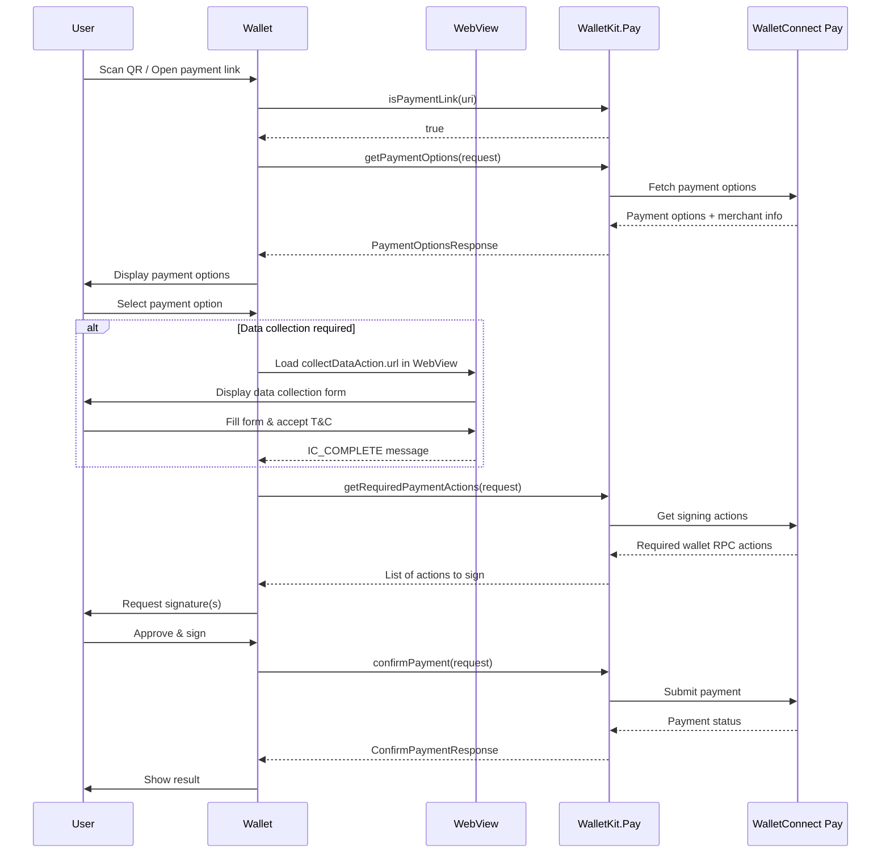

import AppIdSnippet from "/snippets/app-id.mdx";
import WebViewOverview from "/snippets/webview-data-collection-overview.mdx";
import WebViewBestPractices from "/snippets/webview-data-collection-best-practices.mdx";
import WebViewMessageTypes from "/snippets/webview-message-types.mdx";

This documentation covers integrating WalletConnect Pay through ReownWalletKit. This approach provides a unified API where Pay is automatically initialized alongside WalletKit, simplifying the integration for wallet developers.

## Sample Wallet

For a complete working example, check out our sample wallet implementation:

<Card title="Sample Wallet - Flutter (WalletKit)" icon="github" href="https://github.com/reown-com/reown_flutter/tree/develop/packages/reown_walletkit/example">
  A reference Flutter wallet app demonstrating WalletConnect Pay via WalletKit.
</Card>

<Tip>
**Using AI for Integration?** If you're using an AI IDE or assistant to help with integration, you can provide it with our comprehensive [AI integration prompt](/payments/wallets/walletkit/ai-prompts/flutter) for better context and guidance.
</Tip>

## Requirements

- Flutter 3.0+
- iOS 13.0+
- Android API 23+
- ReownWalletKit

<AppIdSnippet />

## Installation

Add `reown_walletkit` to your `pubspec.yaml`:

```yaml
dependencies:
  reown_walletkit: ^1.4.0
```

Then run:

```bash
flutter pub get
```

WalletConnectPay is automatically included as a dependency of ReownWalletKit.

<Info>
Check the [pub.dev page](https://pub.dev/packages/reown_walletkit) for the latest version.
</Info>

## Initialization

The `WalletConnectPay` client is automatically initialized during `ReownWalletKit.init()`. No additional setup is required.

```dart
import 'package:reown_walletkit/reown_walletkit.dart';

final walletKit = await ReownWalletKit.createInstance(
  projectId: 'YOUR_PROJECT_ID',
  metadata: PairingMetadata(
    name: 'My Wallet',
    description: 'My Wallet App',
    url: 'https://mywallet.com',
    icons: ['https://mywallet.com/icon.png'],
  ),
);
```

## Accessing the Pay Client

You can access the `WalletConnectPay` instance directly:

```dart
final payClient = walletKit.pay;
```

## Payment Link Detection

Detect if a URI is a payment link before processing:

```dart
if (walletKit.isPaymentLink(uri)) {
  // Handle as payment. See [Get Payment Options] section
} else {
  // Handle as regular WalletConnect pairing
  await walletKit.pair(uri: Uri.parse(uri));
}
```

## Payment Flow

The payment flow consists of six main steps:

**Detect Payment Link -> Get Options -> Collect Data (if required) -> Get Actions -> Sign Actions -> Confirm Payment**



<Steps>

<Step title="Get Payment Options" titleSize="h3">

Retrieve available payment options for a payment link:

```dart
final response = await walletKit.getPaymentOptions(
  request: GetPaymentOptionsRequest(
    paymentLink: 'https://pay.walletconnect.com/pay_123',
    accounts: ['eip155:1:0x...', 'eip155:137:0x...'], // Wallet's CAIP-10 accounts
    includePaymentInfo: true,
  ),
);

print('Payment ID: ${response.paymentId}');
print('Options available: ${response.options.length}');

if (response.info != null) {
  print('Amount: ${response.info!.amount.formatAmount()}');
  print('Merchant: ${response.info!.merchant.name}');
}

// Check which options require data collection (per-option)
for (final option in response.options) {
  if (option.collectData != null) {
    print('Option ${option.id} requires info capture');
  }
}
```

</Step>

<Step title="Collect User Data (If Required)" titleSize="h3">

After the user selects an option, check for `collectData` on it. If present, collect the data **before** fetching the required actions.

<WebViewOverview />

```dart
if (selectedOption.collectData?.url != null) {
  // Use the "required" list from selectedOption.collectData.schema to determine which fields to prefill
  final prefillData = {
    'fullName': 'John Doe',
    'dob': '1990-01-15',
    'pobAddress': '123 Main St, New York, NY 10001',
  };
  // Encode prefill as base64url
  final prefillBase64 = base64Url.encode(utf8.encode(jsonEncode(prefillData)));
  final uri = Uri.parse(selectedOption.collectData!.url);
  final webViewUrl = uri.replace(
    queryParameters: {
      ...uri.queryParameters,
      'prefill': prefillBase64,
      // Optional appearance params (see "Form URL parameters"):
      'theme': 'dark', // "light" | "dark"
      // themeVariables is a base64url string exported from the Pay Dashboard:
      // 'themeVariables': themeVariables,
    },
  ).toString();

  // Show WebView and wait for IC_COMPLETE message
  showDataCollectionWebView(webViewUrl);
}
```

<WebViewMessageTypes />

</Step>

<Step title="Get Required Actions" titleSize="h3">

Get the required wallet actions for a selected payment option:

```dart
final actions = await walletKit.getRequiredPaymentActions(
  request: GetRequiredPaymentActionsRequest(
    optionId: 'option-id',
    paymentId: 'payment-id',
  ),
);

// Process each action (e.g., sign transactions)
for (final action in actions) {
  final walletRpc = action.walletRpc;
  print('Chain ID: ${walletRpc.chainId}');
  print('Method: ${walletRpc.method}');

  // Dispatch based on walletRpc.method — see Sign Actions below
}
```

</Step>

<Step title="Sign Actions" titleSize="h3">

Sign each action using your wallet's signing implementation, dispatching on the RPC method:

```dart
// Sign each action based on its RPC method
final signatures = <String>[];
for (final action in actions) {
  final rpc = action.walletRpc;
  switch (rpc.method) {
    case 'eth_signTypedData_v4':
      signatures.add(await signTypedData(rpc.chainId, rpc.params));
      break;
    case 'eth_sendTransaction':
      signatures.add(await sendTransaction(rpc.chainId, rpc.params));
      break;
    case 'personal_sign':
      signatures.add(await personalSign(rpc.chainId, rpc.params));
      break;
    default:
      throw UnimplementedError('Unsupported RPC method: ${rpc.method}');
  }
}
```

<Note>
Payment options may include multiple actions with different RPC methods. For example, a Permit2 payment where the user lacks sufficient allowance returns two actions: an `eth_sendTransaction` to approve the token allowance, followed by an `eth_signTypedData_v4` to sign the Permit2 transfer. Your wallet must check `action.walletRpc.method` and dispatch to the appropriate handler. For full implementation guidance, see [USDT support](/payments/wallets/token-chain-support/usdt-support).
</Note>

<Warning>
Signatures must be in the same order as the actions array.
</Warning>

</Step>

<Step title="Confirm Payment" titleSize="h3">

Confirm the payment with the collected signatures:

```dart
final confirmResponse = await walletKit.confirmPayment(
  request: ConfirmPaymentRequest(
    paymentId: 'payment-id',
    optionId: 'option-id',
    signatures: ['0x...', '0x...'], // Signatures from wallet actions
    maxPollMs: 60000, // Maximum polling time in milliseconds
  ),
);

print('Payment Status: ${confirmResponse.status}');
print('Is Final: ${confirmResponse.isFinal}');
```

<Note>
When using the WebView data-collection approach, you do **not** pass `collectedData` to `confirmPayment`. The WebView submits the collected data directly to the backend during the earlier Collect User Data step.
</Note>

</Step>

</Steps>

## Data Collection Implementation

When `selectedOption.collectData.url` is present, display the URL in a WebView using `webview_flutter` (v4.10.0+). Add dependencies:

```yaml
dependencies:
  webview_flutter: ^4.10.0
  url_launcher: ^6.1.0
```

<WebViewBestPractices />

```dart
import 'dart:convert';
import 'package:flutter/material.dart';
import 'package:webview_flutter/webview_flutter.dart';
import 'package:url_launcher/url_launcher.dart';

class PayDataCollectionWebView extends StatefulWidget {
  final String url;
  final VoidCallback onComplete;
  final ValueChanged<String> onError;

  const PayDataCollectionWebView({
    super.key,
    required this.url,
    required this.onComplete,
    required this.onError,
  });

  @override
  State<PayDataCollectionWebView> createState() =>
      _PayDataCollectionWebViewState();
}

class _PayDataCollectionWebViewState extends State<PayDataCollectionWebView> {
  late final WebViewController _controller;
  bool _isLoading = true;

  @override
  void initState() {
    super.initState();
    _controller = WebViewController()
      ..setJavaScriptMode(JavaScriptMode.unrestricted)
      ..setNavigationDelegate(NavigationDelegate(
        onPageFinished: (_) => setState(() => _isLoading = false),
        onNavigationRequest: (request) {
          if (!request.url.contains('pay.walletconnect.com')) {
            launchUrl(Uri.parse(request.url),
                mode: LaunchMode.externalApplication);
            return NavigationDecision.prevent;
          }
          return NavigationDecision.navigate;
        },
      ))
      ..addJavaScriptChannel(
        'ReactNativeWebView',
        onMessageReceived: (message) {
          try {
            final data = jsonDecode(message.message) as Map<String, dynamic>;
            switch (data['type']) {
              case 'IC_COMPLETE':
                widget.onComplete();
                break;
              case 'IC_ERROR':
                widget.onError(data['error'] ?? 'Unknown error');
                break;
            }
          } catch (_) {}
        },
      )
      ..loadRequest(Uri.parse(widget.url));
  }

  @override
  Widget build(BuildContext context) {
    return Stack(
      children: [
        WebViewWidget(controller: _controller),
        if (_isLoading)
          const Center(child: CircularProgressIndicator()),
      ],
    );
  }
}
```

## Complete Example

Here's a complete example of processing a payment:

```dart
import 'package:reown_walletkit/reown_walletkit.dart';

class PaymentService {
  final ReownWalletKit walletKit;

  PaymentService(this.walletKit);

  /// Process a payment from a payment link (e.g., after scanning QR code)
  Future<void> processPayment(String paymentLink) async {
    try {
      // Step 1: Get payment options
      final accounts = await getWalletAccounts(); // Your wallet accounts
      final optionsResponse = await walletKit.getPaymentOptions(
        request: GetPaymentOptionsRequest(
          paymentLink: paymentLink,
          accounts: accounts,
          includePaymentInfo: true,
        ),
      );

      if (optionsResponse.options.isEmpty) {
        throw Exception('No payment options available');
      }

      // Step 2: Select payment option (or let user choose)
      PaymentOption selectedOption = optionsResponse.options.first;
      final paymentId = optionsResponse.paymentId;
      final optionId = selectedOption.id;

      // Step 3: Collect data via WebView if required for selected option.
      // This must happen BEFORE fetching the required payment actions —
      // the backend rejects the actions request with 400 "IC data required"
      // for options needing Information Capture if data wasn't collected first.
      // The WebView submits the data directly to the backend, so it is NOT
      // passed to confirmPayment later.
      if (selectedOption.collectData?.url != null) {
        await showDataCollectionWebView(selectedOption.collectData!.url);
      }

      // Step 4: Get required payment actions (if not already in the option)
      List<Action> actions = selectedOption.actions;
      if (actions.isEmpty) {
        actions = await walletKit.getRequiredPaymentActions(
          request: GetRequiredPaymentActionsRequest(
            optionId: optionId,
            paymentId: paymentId,
          ),
        );
      }

      // Step 5: Execute wallet actions and collect signatures
      final signatures = <String>[];
      for (final action in actions) {
        // Dispatch based on action.walletRpc.method:
        // 'eth_signTypedData_v4' -> sign EIP-712 typed data
        // 'eth_sendTransaction'  -> send transaction (e.g., token approval)
        // 'personal_sign'        -> personal message signing
        signatures.add(await signAction(action.walletRpc));
      }

      // Step 6: Confirm payment
      ConfirmPaymentResponse confirmResponse = await walletKit.confirmPayment(
        request: ConfirmPaymentRequest(
          paymentId: paymentId,
          optionId: optionId,
          signatures: signatures,
          maxPollMs: 60000, // Maximum polling time in milliseconds
        ),
      );

      // Step 7: Poll until final status (if needed)
      while (!confirmResponse.isFinal && confirmResponse.pollInMs != null) {
        await Future.delayed(Duration(milliseconds: confirmResponse.pollInMs!));
        confirmResponse = await walletKit.confirmPayment(
          request: ConfirmPaymentRequest(
            paymentId: paymentId,
            optionId: optionId,
            signatures: signatures,
            maxPollMs: 60000,
          ),
        );
      }

      // Handle final payment status
      switch (confirmResponse.status) {
        case PaymentStatus.succeeded:
          print('Payment succeeded!');
          break;
        case PaymentStatus.failed:
          throw Exception('Payment failed');
        case PaymentStatus.expired:
          throw Exception('Payment expired');
        case PaymentStatus.cancelled:
          throw Exception('Payment cancelled');
        case PaymentStatus.requires_action:
          throw Exception('Payment requires additional action');
        case PaymentStatus.processing:
          // Should not happen if isFinal is true
          break;
      }
    } catch (e) {
      print('Payment error: $e');
      rethrow;
    }
  }

  Future<List<String>> getWalletAccounts() async {
    // Return your wallet's CAIP-10 formatted accounts
    // Example: ['eip155:1:0x1234...', 'eip155:137:0x5678...']
    return [];
  }
}
```

## Direct Access

You can also access the underlying `WalletConnectPay` instance directly if needed:

```dart
final payClient = walletKit.pay;
// Use payClient methods directly
final response = await payClient.getPaymentOptions(request: request);
```

## API Reference

**ReownWalletKit Pay Methods**

| Method | Description |
|--------|-------------|
| `isPaymentLink(String uri)` | Check if URI is a payment link |
| `getPaymentOptions({required GetPaymentOptionsRequest request})` | Get available payment options |
| `getRequiredPaymentActions({required GetRequiredPaymentActionsRequest request})` | Get actions requiring signatures |
| `confirmPayment({required ConfirmPaymentRequest request})` | Confirm and finalize payment |
| `pay` | Access the underlying WalletConnectPay instance |

**Models**

**GetPaymentOptionsRequest**

```dart
GetPaymentOptionsRequest({
  required String paymentLink,
  required List<String> accounts,
  @Default(false) bool includePaymentInfo,
})
```

**PaymentOptionsResponse**

```dart
PaymentOptionsResponse({
  required String paymentId,
  PaymentInfo? info,
  required List<PaymentOption> options,
  CollectDataAction? collectData,
  PaymentResultInfo? resultInfo,     // Transaction result details (present when payment already completed)
})
```

**PaymentResultInfo**

```dart
class PaymentResultInfo {
  final String txId;               // Transaction ID
  final PayAmount optionAmount;    // Token amount details
}
```

**PaymentInfo**

```dart
PaymentInfo({
  required PaymentStatus status,
  required PayAmount amount,
  required int expiresAt,
  required MerchantInfo merchant,
  BuyerInfo? buyer,
})
```

**PaymentOption**

```dart
PaymentOption({
  required String id,
  required String account,
  required PayAmount amount,
  @JsonKey(name: 'etaS') required int etaSeconds,
  required List<Action> actions,
  CollectDataAction? collectData,  // Per-option data collection (null if not required)
})
```

**ConfirmPaymentRequest**

```dart
ConfirmPaymentRequest({
  required String paymentId,
  required String optionId,
  required List<String> signatures,
  int? maxPollMs,
})
```

**ConfirmPaymentResponse**

```dart
ConfirmPaymentResponse({
  required PaymentStatus status,
  required bool isFinal,
  int? pollInMs,
  PaymentResultInfo? info,           // Transaction result details (present on success)
})
```

**PaymentStatus**

```dart
enum PaymentStatus {
  requires_action,
  processing,
  succeeded,
  failed,
  expired,
  cancelled,
}
```

**CollectDataAction**

```dart
class CollectDataAction {
  final String url;                // WebView URL for data collection
  final String? schema;            // JSON schema describing required fields
}
```

## Error Handling

The SDK throws specific exception types for different error scenarios. All errors extend the abstract `PayError` class, which itself extends `PlatformException`:

```dart
abstract class PayError extends PlatformException {
  PayError({
    required super.code,
    required super.message,
    required super.details,
    required super.stacktrace,
  });
}
```

| Exception | Description |
|-----------|-------------|
| `PayInitializeError` | Initialization failures |
| `GetPaymentOptionsError` | Errors when fetching payment options |
| `GetRequiredActionsError` | Errors when getting required actions |
| `ConfirmPaymentError` | Errors when confirming payment |

All errors include:
- `code`: Error code
- `message`: Error message
- `details`: Additional error details
- `stacktrace`: Stack trace

**Example Error Handling**

```dart
try {
  final response = await walletKit.getPaymentOptions(request: request);
} on GetPaymentOptionsError catch (e) {
  print('Error code: ${e.code}');
  print('Error message: ${e.message}');
} on PayError catch (e) {
  // Catch any Pay-related error
  print('Pay error: ${e.message}');
} catch (e) {
  print('Unexpected error: $e');
}
```

## Best Practices

1. **Use WalletKit Integration**: If your wallet already uses WalletKit, prefer this approach for automatic configuration

2. **Use `isPaymentLink()` for Detection**: Use the utility method instead of manual URL parsing for reliable payment link detection

3. **Account Format**: Always use CAIP-10 format for accounts: `eip155:{chainId}:{address}`

4. **Multiple Chains**: Provide accounts for all supported chains to maximize payment options

5. **Signature Order**: Maintain the same order of signatures as the actions array

6. **Error Handling**: Always handle errors gracefully and show appropriate user feedback

7. **Loading States**: Show loading indicators during API calls and signing operations

8. **Expiration**: Check `paymentInfo.expiresAt` and warn users if time is running low

9. **User Data**: Only collect data when `collectData` is present in the response and you don't already have the required user data. If you already have the required data, you can submit this without collecting from the user. You must make sure the user accepts WalletConnect Terms and Conditions and Privacy Policy before submitting user information to WalletConnect.

10. **WebView Data Collection**: When `selectedOption.collectData.url` is present, display the URL in a WebView using `webview_flutter` rather than building native forms. The WebView handles form rendering, validation, and T&C acceptance.

