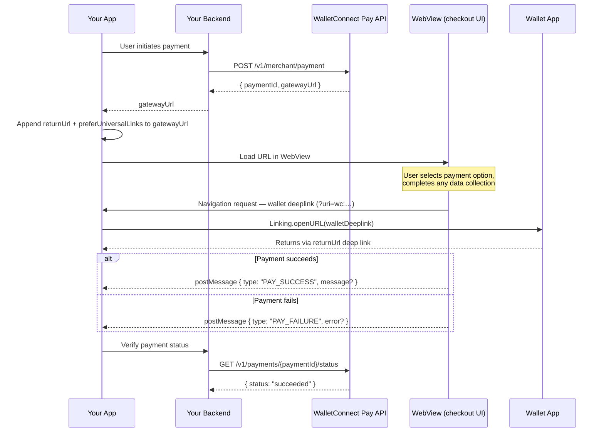

Instead of redirecting users to an external browser, load the WalletConnect Pay checkout portal inside a native WebView. Supply two query parameters on the `gatewayUrl`, handle JavaScript bridge messages for the outcome, and intercept wallet deeplinks so the OS can route the user to their wallet app and back.

The hosted UI handles wallet selection, payment option display, compliance data collection, and signing orchestration. Your app only needs to render a WebView, respond to the result, and verify it server-side.

## How It Works



## Prerequisites

- A `gatewayUrl` from the [Merchant API](/payments/ecommerce/integration) (`POST /v1/merchant/payment`)
- Your app registered to handle its own deep link scheme (so wallets can return after signing)
- JavaScript and DOM storage enabled in the WebView

## URL Construction

Start with the `gatewayUrl` the API returns and append the two WebView parameters. **Never construct the base URL manually.**

```typescript
function buildPayUrl(gatewayUrl: string, appDeepLink: string): string {
  const url = new URL(gatewayUrl);
  // Required: the wallet returns here after signing
  url.searchParams.set('returnUrl', appDeepLink);
  // Required: open wallets via universal links instead of custom schemes
  url.searchParams.set('preferUniversalLinks', '1');
  return url.toString();
}

// Example
const payUrl = buildPayUrl(
  'https://pay.walletconnect.com/buy?pid=pay_01ABC',
  'myapp://'   // your app's registered deep link
);
```

| Parameter | Required | Description |
|---|---|---|
| `returnUrl` | **Yes** | Your app's native deep link (e.g. `myapp://`). The checkout passes this to wallets as the return destination so the OS routes the user back after signing. |
| `preferUniversalLinks` | Recommended | Set to `1`. Tells the checkout to open wallets via universal links (`https://`) rather than custom URL schemes when both are available — more reliable on iOS. |

## Bridge Messages

The checkout calls `window.ReactNativeWebView.postMessage(json)` with a JSON string payload.

| `type` field | `success` field | Meaning |
|---|---|---|
| `PAY_SUCCESS` | `true` | Payment succeeded. Optionally contains `message` — a human-readable confirmation summary. |
| `PAY_FAILURE` | `false` | Payment failed. Optionally contains `error` — a human-readable reason. |

<Note>
The checkout may send either the `type` field or the `success` boolean (or both). Treat `type === "PAY_SUCCESS"` **or** `success === true` as a success signal; `type === "PAY_FAILURE"` **or** `success === false` as failure.
</Note>

<Warning>
Always verify the final payment status server-side via `GET /v1/payments/{paymentId}/status` after receiving `PAY_SUCCESS`. Never rely solely on the bridge message to confirm a payment.
</Warning>

## Wallet Deeplink Interception

The checkout opens the user's wallet by navigating to a URL that carries a `?uri=wc:…` query parameter. WebViews don't handle these natively, so **your app must intercept these navigations and forward them to the OS**.

This applies to both same-frame navigations and `window.open()` calls. Only forward URLs that carry a valid `wc:` URI — block any other non-`https:` navigation to prevent the page from driving `Linking.openURL` to arbitrary native schemes (`tel:`, `sms:`, `intent:`, etc.).

```typescript
function isWalletDeeplink(url: string): boolean {
  try {
    const wcUri = new URL(url).searchParams.get('uri');
    return !!wcUri && wcUri.startsWith('wc:');
  } catch {
    return false;
  }
}
```

## Platform Examples

<Tabs>
<Tab title="React Native">

Install the WebView package:

```bash
npm install react-native-webview
```

```tsx
import React, {useCallback} from 'react';
import {Linking, StyleSheet} from 'react-native';
import {WebView, WebViewMessageEvent} from 'react-native-webview';
import type {
  ShouldStartLoadRequest,
  WebViewOpenWindowEvent,
} from 'react-native-webview/lib/WebViewTypes';

type PayMessage = {
  type?: 'PAY_SUCCESS' | 'PAY_FAILURE';
  success?: boolean;
  error?: string;
  message?: string;
};

function isWalletDeeplink(url: string): boolean {
  try {
    const wcUri = new URL(url).searchParams.get('uri');
    return !!wcUri && wcUri.startsWith('wc:');
  } catch {
    return false;
  }
}

function buildPayUrl(gatewayUrl: string, appDeepLink: string): string {
  const url = new URL(gatewayUrl);
  url.searchParams.set('returnUrl', appDeepLink);
  url.searchParams.set('preferUniversalLinks', '1');
  return url.toString();
}

interface PayWebViewProps {
  gatewayUrl: string;
  appDeepLink: string;
  onSuccess: (message?: string) => void;
  onFailure: (error?: string) => void;
}

export function PayWebView({gatewayUrl, appDeepLink, onSuccess, onFailure}: PayWebViewProps) {
  const url = buildPayUrl(gatewayUrl, appDeepLink);

  const onShouldStartLoadWithRequest = useCallback(
    (request: ShouldStartLoadRequest): boolean => {
      if (isWalletDeeplink(request.url)) {
        Linking.openURL(request.url).catch(console.warn);
        return false;
      }
      return true;
    },
    [],
  );

  const onOpenWindow = useCallback((event: WebViewOpenWindowEvent) => {
    const {targetUrl} = event.nativeEvent;
    if (isWalletDeeplink(targetUrl)) {
      Linking.openURL(targetUrl).catch(console.warn);
    }
  }, []);

  const onMessage = useCallback(
    (event: WebViewMessageEvent) => {
      let msg: PayMessage;
      try {
        msg = JSON.parse(event.nativeEvent.data);
      } catch {
        return;
      }
      if (msg.type === 'PAY_SUCCESS' || msg.success === true) {
        onSuccess(msg.message);
      } else if (msg.type === 'PAY_FAILURE' || msg.success === false) {
        onFailure(msg.error);
      }
    },
    [onSuccess, onFailure],
  );

  return (
    <WebView
      source={{uri: url}}
      style={styles.webview}
      startInLoadingState
      javaScriptEnabled
      domStorageEnabled
      setSupportMultipleWindows
      onShouldStartLoadWithRequest={onShouldStartLoadWithRequest}
      onOpenWindow={onOpenWindow}
      onMessage={onMessage}
    />
  );
}

const styles = StyleSheet.create({webview: {flex: 1}});
```

<Info>
`setSupportMultipleWindows` must be `true` for `onOpenWindow` to receive `window.open()` calls. Without it, wallet deeplinks opened via `window.open()` are silently dropped.
</Info>

</Tab>
<Tab title="Android (Kotlin)">

```kotlin
import android.content.Intent
import android.net.Uri
import android.webkit.JavascriptInterface
import android.webkit.WebResourceRequest
import android.webkit.WebView
import android.webkit.WebViewClient
import androidx.compose.runtime.Composable
import androidx.compose.ui.viewinterop.AndroidView
import org.json.JSONObject

fun buildPayUrl(gatewayUrl: String, appDeepLink: String): String =
    Uri.parse(gatewayUrl).buildUpon()
        .appendQueryParameter("returnUrl", appDeepLink)
        .appendQueryParameter("preferUniversalLinks", "1")
        .build().toString()

fun isWalletDeeplink(url: String): Boolean = try {
    Uri.parse(url).getQueryParameter("uri")?.startsWith("wc:") == true
} catch (_: Exception) { false }

@Composable
fun PayWebView(
    gatewayUrl: String,
    appDeepLink: String,
    onSuccess: (message: String?) -> Unit,
    onFailure: (error: String?) -> Unit
) {
    AndroidView(factory = { context ->
        WebView(context).apply {
            settings.javaScriptEnabled = true
            settings.domStorageEnabled = true
            settings.allowFileAccess = false
            addJavascriptInterface(
                object {
                    @JavascriptInterface
                    fun postMessage(json: String) {
                        try {
                            val msg = JSONObject(json)
                            val type = msg.optString("type")
                            val success = msg.optBoolean("success", false)
                            when {
                                type == "PAY_SUCCESS" || (success && type.isEmpty()) ->
                                    onSuccess(msg.optString("message").ifEmpty { null })
                                type == "PAY_FAILURE" || (!success && type.isNotEmpty()) ->
                                    onFailure(msg.optString("error").ifEmpty { null })
                            }
                        } catch (_: Exception) {}
                    }
                },
                "ReactNativeWebView"
            )
            webViewClient = object : WebViewClient() {
                override fun shouldOverrideUrlLoading(view: WebView?, request: WebResourceRequest?): Boolean {
                    val reqUrl = request?.url?.toString() ?: return false
                    if (isWalletDeeplink(reqUrl)) {
                        context.startActivity(Intent(Intent.ACTION_VIEW, Uri.parse(reqUrl)))
                        return true
                    }
                    return false
                }
            }
            loadUrl(buildPayUrl(gatewayUrl, appDeepLink))
        }
    })
}
```

</Tab>
<Tab title="iOS (Swift)">

```swift
import SwiftUI
import WebKit

struct PayWebView: UIViewRepresentable {
    let gatewayUrl: String
    let appDeepLink: String
    var onSuccess: (String?) -> Void
    var onFailure: (String?) -> Void

    func makeCoordinator() -> Coordinator {
        Coordinator(onSuccess: onSuccess, onFailure: onFailure)
    }

    func makeUIView(context: Context) -> WKWebView {
        let cc = WKUserContentController()
        cc.add(context.coordinator, name: "ReactNativeWebView")
        let config = WKWebViewConfiguration()
        config.userContentController = cc
        let wv = WKWebView(frame: .zero, configuration: config)
        wv.navigationDelegate = context.coordinator
        if let url = buildPayURL() { wv.load(URLRequest(url: url)) }
        return wv
    }

    func updateUIView(_ uiView: WKWebView, context: Context) {}

    private func buildPayURL() -> URL? {
        guard var c = URLComponents(string: gatewayUrl) else { return nil }
        c.queryItems = (c.queryItems ?? []) + [
            URLQueryItem(name: "returnUrl", value: appDeepLink),
            URLQueryItem(name: "preferUniversalLinks", value: "1"),
        ]
        return c.url
    }

    class Coordinator: NSObject, WKScriptMessageHandler, WKNavigationDelegate {
        var onSuccess: (String?) -> Void
        var onFailure: (String?) -> Void

        init(onSuccess: @escaping (String?) -> Void, onFailure: @escaping (String?) -> Void) {
            self.onSuccess = onSuccess; self.onFailure = onFailure
        }

        func userContentController(_ uc: WKUserContentController, didReceive message: WKScriptMessage) {
            guard message.name == "ReactNativeWebView",
                  let body = message.body as? String,
                  let data = body.data(using: .utf8),
                  let json = try? JSONSerialization.jsonObject(with: data) as? [String: Any]
            else { return }
            let type = json["type"] as? String ?? ""
            let success = json["success"] as? Bool
            if type == "PAY_SUCCESS" || success == true { onSuccess(json["message"] as? String) }
            else if type == "PAY_FAILURE" || success == false { onFailure(json["error"] as? String) }
        }

        func webView(_ wv: WKWebView, decidePolicyFor action: WKNavigationAction,
                     decisionHandler: @escaping (WKNavigationActionPolicy) -> Void) {
            if let url = action.request.url, isWalletDeeplink(url) {
                UIApplication.shared.open(url); decisionHandler(.cancel); return
            }
            decisionHandler(.allow)
        }

        private func isWalletDeeplink(_ url: URL) -> Bool {
            URLComponents(url: url, resolvingAgainstBaseURL: false)?
                .queryItems?.first(where: { $0.name == "uri" })?.value?.hasPrefix("wc:") ?? false
        }
    }
}
```

</Tab>
<Tab title="Flutter">

```dart
import 'dart:convert';
import 'package:flutter/material.dart';
import 'package:url_launcher/url_launcher.dart';
import 'package:webview_flutter/webview_flutter.dart';

bool isWalletDeeplink(String url) {
  try {
    return Uri.parse(url).queryParameters['uri']?.startsWith('wc:') ?? false;
  } catch (_) { return false; }
}

String buildPayUrl(String gatewayUrl, String appDeepLink) {
  final uri = Uri.parse(gatewayUrl);
  return uri.replace(queryParameters: {
    ...uri.queryParameters,
    'returnUrl': appDeepLink,
    'preferUniversalLinks': '1',
  }).toString();
}

class PayWebView extends StatefulWidget {
  final String gatewayUrl;
  final String appDeepLink;
  final void Function(String? message) onSuccess;
  final void Function(String? error) onFailure;

  const PayWebView({super.key, required this.gatewayUrl, required this.appDeepLink,
      required this.onSuccess, required this.onFailure});

  @override
  State<PayWebView> createState() => _PayWebViewState();
}

class _PayWebViewState extends State<PayWebView> {
  late final WebViewController _controller;

  @override
  void initState() {
    super.initState();
    _controller = WebViewController()
      ..setJavaScriptMode(JavaScriptMode.unrestricted)
      ..setNavigationDelegate(NavigationDelegate(
        onNavigationRequest: (r) {
          if (isWalletDeeplink(r.url)) {
            launchUrl(Uri.parse(r.url), mode: LaunchMode.externalApplication);
            return NavigationDecision.prevent;
          }
          return NavigationDecision.navigate;
        },
      ))
      ..addJavaScriptChannel('ReactNativeWebView', onMessageReceived: (msg) {
        try {
          final json = jsonDecode(msg.message) as Map<String, dynamic>;
          final type = json['type'] as String? ?? '';
          final success = json['success'] as bool?;
          if (type == 'PAY_SUCCESS' || success == true) widget.onSuccess(json['message'] as String?);
          else if (type == 'PAY_FAILURE' || success == false) widget.onFailure(json['error'] as String?);
        } catch (_) {}
      })
      ..loadRequest(Uri.parse(buildPayUrl(widget.gatewayUrl, widget.appDeepLink)));
  }

  @override
  Widget build(BuildContext context) => WebViewWidget(controller: _controller);
}
```

</Tab>
</Tabs>

## Deep Link Registration

Register your `returnUrl` scheme so the OS routes users back after signing in their wallet.

<Tabs>
<Tab title="Android">

```xml
<!-- AndroidManifest.xml -->
<intent-filter>
    <action android:name="android.intent.action.VIEW" />
    <category android:name="android.intent.category.DEFAULT" />
    <category android:name="android.intent.category.BROWSABLE" />
    <data android:scheme="myapp" />
</intent-filter>
```

</Tab>
<Tab title="iOS">

```xml
<!-- Info.plist -->
<key>CFBundleURLTypes</key>
<array>
  <dict>
    <key>CFBundleURLSchemes</key>
    <array><string>myapp</string></array>
  </dict>
</array>
```

</Tab>
</Tabs>

## Verifying Payment Status

After `PAY_SUCCESS`, confirm server-side before marking the order as paid:

```typescript
const res = await fetch(
  `https://api.pay.walletconnect.com/v1/payments/${paymentId}/status`,
  { headers: { 'Api-Key': process.env.WCP_API_KEY } }
);
const { status } = await res.json(); // "succeeded" | "processing" | "failed" | …
```

See the [Payments Status API](/api-reference/2026-02-18/get-v1-payments-id-status) for the full response schema.

## Best Practices

- **Enable JavaScript and DOM storage** — required; the WebView will not render correctly without them.
- **Always intercept wallet deeplinks** — URLs with `?uri=wc:…` must be forwarded to the OS. Handle both same-frame navigations and `window.open()` calls.
- **Only intercept `wc:` deeplinks** — block other non-`https:` navigations to prevent arbitrary native app launches.
- **Handle both message formats** — check `type === "PAY_SUCCESS"` **and** `success === true` for forward compatibility.
- **Always verify server-side** — treat bridge messages as a trigger to check status, not as proof of payment.
- **Keep the WebView full-screen or modal** — the checkout is optimized for full viewport rendering.

## Reference Example

<Card title="PayWebView — React Native example" icon="github" href="https://github.com/reown-com/react-native-examples/pull/570">
  Full implementation including success animation, wallet deeplink handling, and error recovery.
</Card>
