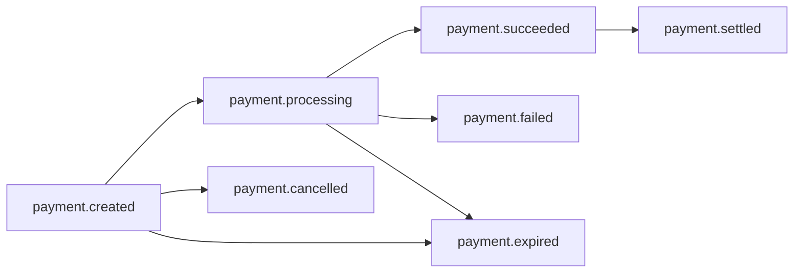

Webhooks push payment lifecycle events to an HTTPS endpoint you control, as they happen. Instead of polling for every payment, you register an endpoint once and we `POST` an event to it whenever a payment is created, starts processing, succeeds, fails, expires, is cancelled, or settles.

## Webhooks vs. polling

Webhooks are for **notifications**. They tell you promptly that something happened, so you can react quickly: update the order status in your UI, notify a customer, kick off downstream processing.

On the **critical path, always poll**. Before you do anything irreversible, such as releasing goods, crediting a balance, or marking an order paid, confirm the payment state with [`GET /v1/payments/{id}/status`](/api-reference/latest/get-v1-payments-id-status). Webhooks let you relax the polling schedule (for example, to every 5 seconds instead of something more aggressive), and when a webhook event arrives, confirm it right away by fetching the payment state. Treat the webhook as the trigger to go check, not as the authorization itself.

This matters because webhook delivery is **at-least-once** and **not guaranteed to be in order** (see [Delivery guarantees](#delivery-guarantees)). A well-built integration works correctly even if a webhook arrives twice, late, out of order, or not at all.

## Events

Every event is named `payment.<stage>`:

| Event type | Sent when |
|---|---|
| `payment.created` | A payment was created. |
| `payment.processing` | A payment started processing: the buyer has committed funds. |
| `payment.succeeded` | A payment succeeded. |
| `payment.failed` | A payment failed. |
| `payment.expired` | A payment expired before completion. |
| `payment.cancelled` | A payment was cancelled. |
| `payment.settled` | Merchant settlement completed for a succeeded payment. |



When you register an endpoint you choose which event types it receives; by default it receives all seven.

## The event payload

Every event carries the same envelope, and `data` is always a **full snapshot of the payment at the moment the event occurred**, never a delta. You never need a previous event to interpret the current one.

| Field | Description |
|---|---|
| `id` | Unique event ID (`evt_…`). **Your deduplication key**: the same event is always delivered with the same `id`. |
| `type` | The event type, e.g. `payment.succeeded`. |
| `api_version` | The payload schema version (e.g. `2026-05-18`). Within a version, changes are additive only. |
| `created_at` | When the event occurred (ISO 8601, UTC), not when it was delivered. |
| `data` | The full payment snapshot at event time. |

The fields inside `data` you'll use most:

| Field | Description |
|---|---|
| `payment_id` / `merchant_id` | The same identifiers you use across the Merchant API. |
| `reference_id` | Your own order identifier, as passed when creating the payment (or `null`). |
| `status` | The payment status at event time: `requires_action`, `processing`, `succeeded`, `failed`, `expired`, or `cancelled`. |
| `payment_state_version` | Monotonically increasing integer per payment. **Your ordering key**; see [Out-of-order delivery](#out-of-order-delivery). |
| `live` | `false` for test-mode payments and test deliveries. **Check `live === true` before driving real fulfillment.** |
| `amount` | The requested amount: `{ "unit": "iso4217/USD", "value": "1000" }`, where `value` is an integer string in the smallest unit. |
| `processing`, `success`, `failed`, `cancelled`, `expired`, `settled` | Stage detail blocks, `null` until the payment reaches that stage. `success` and `settled` include the transaction hash (`tx_id`). |

A `payment.succeeded` event looks like this:

```json
{
  "id": "evt_01HZX4V9K3TQ2M8R6W0B5YD7FN",
  "type": "payment.succeeded",
  "api_version": "2026-05-18",
  "created_at": "2026-06-30T10:00:00Z",
  "data": {
    "payment_id": "pay_01HZX4V9K3T",
    "merchant_id": "mrch_7kBz2qR9xPvLmN4Yw",
    "live": true,
    "payment_state_version": 2,
    "reference_id": "ORDER-1042",
    "status": "succeeded",
    "amount": { "unit": "iso4217/USD", "value": "1000" },
    "created_at": "2026-06-30T09:59:00Z",
    "expires_at": "2026-06-30T10:14:00Z",
    "processing": {
      "processing_at": "2026-06-30T09:59:10Z",
      "option_amount": {
        "unit": "caip19/eip155:8453/erc20:0x833589fCD6eDb6E08f4c7C32D4f71b54bdA02913",
        "value": "10000000"
      },
      "settlement_amount": {
        "unit": "caip19/eip155:8453/erc20:0x833589fCD6eDb6E08f4c7C32D4f71b54bdA02913",
        "value": "9710000"
      },
      "buyer_caip10": "eip155:8453:0x000000000000000000000000000000000000dEaD",
      "chain_caip2": "eip155:8453"
    },
    "success": {
      "succeeded_at": "2026-06-30T10:00:00Z",
      "tx_id": "0x8f1e5c1b9a4a1d2e3f405162738495a6b7c8d9e0f1a2b3c4d5e6f708192a3b4c"
    },
    "failed": null,
    "cancelled": null,
    "expired": null,
    "settled": null
  }
}
```

<Warning>
**Parse tolerantly.** New fields are added to the payload over time without a version bump; that is the additive-only contract. Ignore fields you don't recognize, and never reject an event because it contains something new. Strict schema validation that fails on unknown fields **will** break your integration.
</Warning>

## Delivery guarantees

Design your handler around three properties of webhook delivery. Getting these right up front is the difference between an integration that works in a demo and one that works in production.

### At-least-once delivery

Every event is delivered *at least* once, which means occasionally more than once. Deduplicate on the event `id`: record each `id` you've processed (with a TTL of a few days), and acknowledge but skip any event whose `id` you've already seen.

### Out-of-order delivery

Events for the same payment can arrive out of order. A `payment.succeeded` may land before the `payment.processing` that preceded it, especially when retries are involved. Two rules keep you safe:

1. **Compare `payment_state_version`.** It increases with every state change of a payment. Keep the highest version you've processed per `payment_id`, and ignore any event with a version less than or equal to it, because it is stale.
2. **Poll for the critical path.** Since each event is a full snapshot, a late event never corrupts your state if you follow rule 1. For irreversible actions, though, confirm with [`GET /v1/payments/{id}/status`](/api-reference/latest/get-v1-payments-id-status) rather than acting on the webhook alone.

### Retries

An attempt counts as delivered only when your endpoint responds with a **2xx** status. Any other response, including redirects (which are not followed), or a timeout counts as a failure, and the delivery is retried with increasing back-off:

| Attempt | Time after previous attempt |
|---|---|
| 1 | immediate |
| 2 | 5 seconds |
| 3 | 5 minutes |
| 4 | 30 minutes |
| 5 | 2 hours |
| 6 | 5 hours |
| 7 | 10 hours |
| 8 | 10 hours |

That's roughly **28 hours** of automatic retries. After the final attempt the delivery is marked failed and is **not retried automatically**, so recovering from a longer outage is manual. Check your endpoint's delivery history in the dashboard, and reconcile missed payments by fetching their current state from the API.

<Tip>
Acknowledge first, process later. Return `200` as soon as you've verified the signature and durably queued the event, and don't make the webhook response wait on your business logic. Slow responses time out, count as failed attempts, and cause redundant redeliveries.
</Tip>

## Set up your endpoint

<Steps>

<Step title="Register the endpoint" stepNumber="1">

1. In the [dashboard](https://merchant.pay.walletconnect.com), make sure the **Test / Live** selector matches the mode you're setting up, since endpoints are configured separately per mode.
2. Open **Webhooks** and add your endpoint: a publicly reachable **HTTPS** URL, and the event types you want (all seven by default).
3. Copy the **signing secret** (`whsec_…`) and store it in a secret manager. You'll use it to verify every delivery.

You can reveal the secret again later, and rotate it from the same page. After a rotation, the old secret stays valid for 24 hours so you can roll over without dropping deliveries.

<Note>
You can register one webhook endpoint per mode. Test and live endpoints are fully separate, each with its own signing secret.
</Note>

</Step>

<Step title="Verify signatures" stepNumber="2">

Every delivery is signed so you can confirm it came from WalletConnect Pay and wasn't tampered with. The signature is a **standard HMAC-SHA256**, so you don't need any SDK to verify it. It arrives in three headers on every delivery:

| Header | Contents |
|---|---|
| `svix-id` | The delivery's message ID. |
| `svix-timestamp` | Unix timestamp (seconds) of the attempt. |
| `svix-signature` | Space-separated list of signatures, each formatted `v1,<base64 digest>`. There can be more than one, for example during the 24-hour secret rotation overlap. |

Verification is four steps:

1. **Derive the key.** Take your signing secret, strip the `whsec_` prefix, and base64-decode the rest. The decoded bytes are the HMAC key (using the string itself is the most common mistake).
2. **Compute the digest.** HMAC-SHA256 over the UTF-8 bytes of `{svix-id}.{svix-timestamp}.{raw body}`, then base64-encode it.
3. **Compare.** The delivery is authentic if your digest equals any `v1` entry in `svix-signature`, using a constant-time comparison.
4. **Check the timestamp.** Reject deliveries whose `svix-timestamp` is more than 5 minutes from the current time, to prevent replay attacks.

Dependency-free implementations, standard library only:

<CodeGroup>

```ts Node.js
import { createHmac, timingSafeEqual } from "node:crypto";

const TOLERANCE_S = 5 * 60;

export function verifyWebhook(secret: string, headers: Record<string, string>, rawBody: string) {
  const id = headers["svix-id"];
  const timestamp = headers["svix-timestamp"];
  const signatures = headers["svix-signature"];
  if (!id || !timestamp || !signatures) throw new Error("missing signature headers");

  const skew = Math.abs(Date.now() / 1000 - Number(timestamp));
  if (!Number.isFinite(skew) || skew > TOLERANCE_S) throw new Error("timestamp outside tolerance");

  const key = Buffer.from(secret.slice("whsec_".length), "base64");
  const expected = createHmac("sha256", key)
    .update(`${id}.${timestamp}.${rawBody}`)
    .digest("base64");

  const ok = signatures.split(" ").some((entry) => {
    const [version, sig] = entry.split(",");
    return (
      version === "v1" &&
      sig?.length === expected.length &&
      timingSafeEqual(Buffer.from(sig), Buffer.from(expected))
    );
  });
  if (!ok) throw new Error("no matching signature");
  return JSON.parse(rawBody);
}
```

```python Python
import base64
import hashlib
import hmac
import json
import time

TOLERANCE_S = 5 * 60

def verify_webhook(secret: str, headers: dict, raw_body: bytes) -> dict:
    msg_id = headers.get("svix-id")
    timestamp = headers.get("svix-timestamp")
    signatures = headers.get("svix-signature")
    if not (msg_id and timestamp and signatures):
        raise ValueError("missing signature headers")

    if abs(time.time() - float(timestamp)) > TOLERANCE_S:
        raise ValueError("timestamp outside tolerance")

    key = base64.b64decode(secret.removeprefix("whsec_"))
    signed = f"{msg_id}.{timestamp}.".encode() + raw_body
    expected = base64.b64encode(hmac.new(key, signed, hashlib.sha256).digest()).decode()

    for entry in signatures.split(" "):
        version, _, sig = entry.partition(",")
        if version == "v1" and hmac.compare_digest(sig, expected):
            return json.loads(raw_body)
    raise ValueError("no matching signature")
```

```go Go
package webhooks

import (
	"crypto/hmac"
	"crypto/sha256"
	"encoding/base64"
	"errors"
	"fmt"
	"math"
	"net/http"
	"strconv"
	"strings"
	"time"
)

const toleranceSeconds = 5 * 60

func VerifyWebhook(secret string, headers http.Header, rawBody []byte) error {
	id := headers.Get("svix-id")
	timestamp := headers.Get("svix-timestamp")
	signatures := headers.Get("svix-signature")
	if id == "" || timestamp == "" || signatures == "" {
		return errors.New("missing signature headers")
	}

	ts, err := strconv.ParseFloat(timestamp, 64)
	if err != nil || math.Abs(float64(time.Now().Unix())-ts) > toleranceSeconds {
		return errors.New("timestamp outside tolerance")
	}

	key, err := base64.StdEncoding.DecodeString(strings.TrimPrefix(secret, "whsec_"))
	if err != nil {
		return err
	}

	mac := hmac.New(sha256.New, key)
	fmt.Fprintf(mac, "%s.%s.", id, timestamp)
	mac.Write(rawBody)
	expected := base64.StdEncoding.EncodeToString(mac.Sum(nil))

	for _, entry := range strings.Split(signatures, " ") {
		version, sig, found := strings.Cut(entry, ",")
		if found && version == "v1" && hmac.Equal([]byte(sig), []byte(expected)) {
			return nil
		}
	}
	return errors.New("no matching signature")
}
```

```java Java
import javax.crypto.Mac;
import javax.crypto.spec.SecretKeySpec;
import java.nio.charset.StandardCharsets;
import java.security.MessageDigest;
import java.util.Base64;

public final class WebhookVerifier {
    private static final long TOLERANCE_S = 5 * 60;

    public static void verify(String secret, String id, String timestamp,
                              String signatures, byte[] rawBody) throws Exception {
        long skew = Math.abs(System.currentTimeMillis() / 1000 - Long.parseLong(timestamp));
        if (skew > TOLERANCE_S) throw new SecurityException("timestamp outside tolerance");

        byte[] key = Base64.getDecoder().decode(secret.substring("whsec_".length()));
        Mac mac = Mac.getInstance("HmacSHA256");
        mac.init(new SecretKeySpec(key, "HmacSHA256"));
        mac.update((id + "." + timestamp + ".").getBytes(StandardCharsets.UTF_8));
        byte[] expected = Base64.getEncoder().encode(mac.doFinal(rawBody));

        for (String entry : signatures.split(" ")) {
            String[] parts = entry.split(",", 2);
            if (parts.length == 2 && parts[0].equals("v1")
                    && MessageDigest.isEqual(parts[1].getBytes(StandardCharsets.UTF_8), expected)) {
                return;
            }
        }
        throw new SecurityException("no matching signature");
    }
}
```

```csharp C#
using System.Linq;
using System.Security.Cryptography;
using System.Text;

public static class WebhookVerifier
{
    private const long ToleranceSeconds = 5 * 60;

    public static void Verify(string secret, string id, string timestamp,
                              string signatures, byte[] rawBody)
    {
        var skew = Math.Abs(DateTimeOffset.UtcNow.ToUnixTimeSeconds() - long.Parse(timestamp));
        if (skew > ToleranceSeconds)
            throw new InvalidOperationException("timestamp outside tolerance");

        var key = Convert.FromBase64String(secret["whsec_".Length..]);
        using var hmac = new HMACSHA256(key);
        var signed = Encoding.UTF8.GetBytes($"{id}.{timestamp}.").Concat(rawBody).ToArray();
        var expected = Encoding.UTF8.GetBytes(Convert.ToBase64String(hmac.ComputeHash(signed)));

        foreach (var entry in signatures.Split(' '))
        {
            var parts = entry.Split(',', 2);
            if (parts.Length == 2 && parts[0] == "v1" &&
                CryptographicOperations.FixedTimeEquals(Encoding.UTF8.GetBytes(parts[1]), expected))
                return;
        }
        throw new InvalidOperationException("no matching signature");
    }
}
```

```php PHP
<?php

const TOLERANCE_S = 300;

function verify_webhook(string $secret, array $headers, string $rawBody): array
{
    $id = $headers['svix-id'] ?? '';
    $timestamp = $headers['svix-timestamp'] ?? '';
    $signatures = $headers['svix-signature'] ?? '';
    if ($id === '' || $timestamp === '' || $signatures === '') {
        throw new RuntimeException('missing signature headers');
    }

    if (abs(time() - (int) $timestamp) > TOLERANCE_S) {
        throw new RuntimeException('timestamp outside tolerance');
    }

    $key = base64_decode(substr($secret, strlen('whsec_')), true);
    $expected = base64_encode(hash_hmac('sha256', "$id.$timestamp.$rawBody", $key, true));

    foreach (explode(' ', $signatures) as $entry) {
        [$version, $sig] = array_pad(explode(',', $entry, 2), 2, '');
        if ($version === 'v1' && hash_equals($expected, $sig)) {
            return json_decode($rawBody, true, 512, JSON_THROW_ON_ERROR);
        }
    }
    throw new RuntimeException('no matching signature');
}
```

```ruby Ruby
require "base64"
require "json"
require "openssl"

TOLERANCE_S = 5 * 60

def verify_webhook(secret, headers, raw_body)
  id = headers["svix-id"]
  timestamp = headers["svix-timestamp"]
  signatures = headers["svix-signature"]
  raise "missing signature headers" unless id && timestamp && signatures

  raise "timestamp outside tolerance" if (Time.now.to_i - timestamp.to_i).abs > TOLERANCE_S

  key = Base64.decode64(secret.delete_prefix("whsec_"))
  digest = OpenSSL::HMAC.digest("SHA256", key, "#{id}.#{timestamp}.#{raw_body}")
  expected = Base64.strict_encode64(digest)

  ok = signatures.split(" ").any? do |entry|
    version, sig = entry.split(",", 2)
    version == "v1" && sig && OpenSSL.secure_compare(sig, expected)
  end
  raise "no matching signature" unless ok

  JSON.parse(raw_body)
end
```

</CodeGroup>

Two things trip people up:

- **Verify the raw request body**, byte for byte, before any body-parsing middleware runs. Parsing and re-serializing the JSON changes the bytes (even a whitespace difference) and the verification fails.
- The timestamp check depends on your server clock being accurate.

Reject anything that fails verification with a `400`, and never process an unverified payload. If you already use a [Svix library](https://docs.svix.com/receiving/verifying-payloads/how), its `verify` function performs exactly these checks and is equally fine.

### Or let your coding agent do it

An AI coding agent (Claude Code, Cursor, Codex, and the like) can implement and verify the handler in one shot. The prompt contains the complete spec plus a test vector to validate the implementation against, so paste it into your agent as-is:

<button
  type="button"
  data-wcp-copy-prompt
  style={{
    padding: "0.5rem 1.25rem",
    background: "#0988f0",
    color: "#ffffff",
    fontWeight: 600,
    border: "none",
    borderRadius: "0.5rem",
    cursor: "pointer"
  }}
>
  Copy prompt
</button>

</Step>

<Step title="Test the delivery" stepNumber="3">

Two ways to see events hit your endpoint before any real payment exists:

- **Send a test event.** In the dashboard's **Webhooks** page, send a test event of any type to your endpoint. Test events carry sample data with `live: false`; use them to check signature verification and your 2xx response.
- **Run the full flow in [test mode](/payments/test-mode).** Create a test payment and drive it through its lifecycle with the Test Console or the dashboard's simulation actions. Each transition emits the real webhook, from `payment.created` through `payment.succeeded` (or `failed`, `expired`, `cancelled`), so you can verify your handler against every path, including the ones that are hard to produce on demand with real payments.

The dashboard shows each endpoint's recent deliveries with response status and timing, which is the first place to look when something doesn't arrive.

<Tip>
During local development, expose your handler with a tunnel (e.g. `ngrok`, `cloudflared`) and register the tunnel URL as your test-mode endpoint.
</Tip>

</Step>

</Steps>

## Go live

Webhook configuration does **not** carry over from test to live; they are separate environments end to end. When you switch:

1. Flip the dashboard to **Live** and register your production endpoint URL and event types again.
2. Store the **live signing secret**, which is different from your test secret, and make sure your handler uses the secret matching the environment.
3. Confirm your handler checks `data.live === true` before triggering real fulfillment. Test events and test-mode payments always carry `live: false`.
4. Re-verify the critical path: dedupe by `id`, ordering by `payment_state_version`, and a status poll before anything irreversible.

## Next steps

<CardGroup cols={2}>
  <Card title="Test mode" icon="flask" href="/payments/test-mode">
    Simulate every payment status transition and watch the webhooks arrive.
  </Card>
  <Card title="Get the payment status" icon="magnifying-glass" href="/api-reference/latest/get-v1-payments-id-status">
    The polling endpoint to confirm state on the critical path.
  </Card>
</CardGroup>
