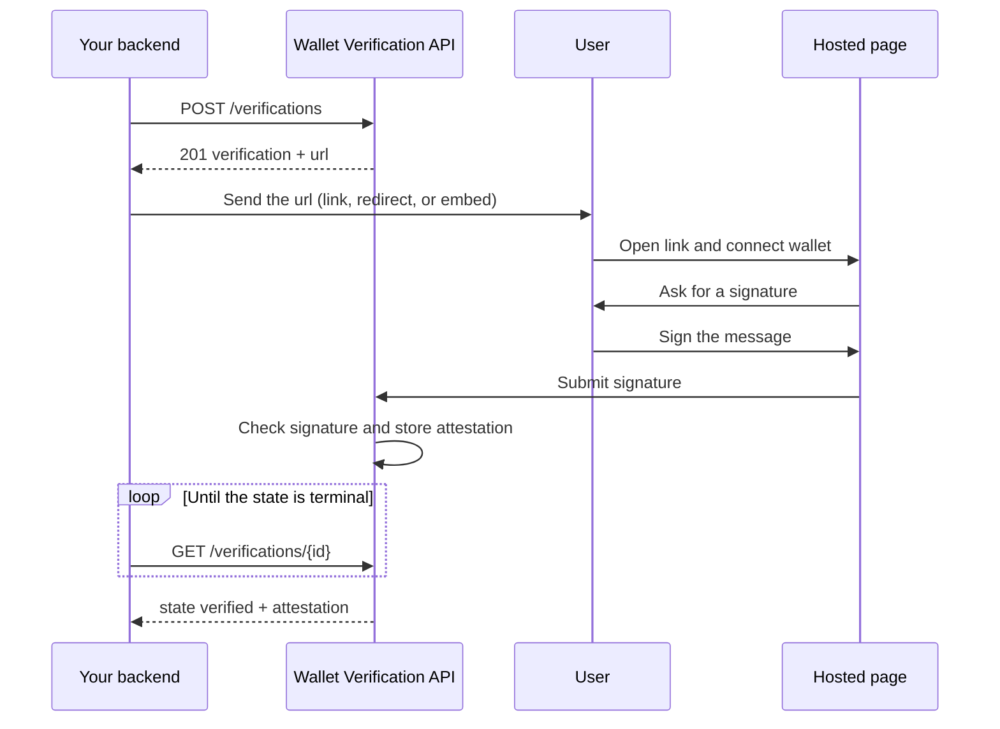

Wallet Verification lets you confirm that a user controls a wallet address before you rely on it. Your backend creates a verification, the user opens a hosted page, connects their wallet, and signs a plain-text message. Wallet Verification checks the signature and stores an attestation that you can read and re-check yourself.

The user only signs a message. No funds move, no transaction is sent, and the user pays no gas.

## Who is Wallet Verification for?

- **Payout platforms and PSPs** that need to confirm a beneficiary controls the destination wallet before sending a payout or approving a withdrawal.
- **Platforms verifying their own customers** that want proof of ownership for the wallets customers link during onboarding or re-verification.
- **Regulated institutions** that need proof of control over self-hosted wallets for Travel Rule checks.

## How does Wallet Verification work?

1. Your backend creates a verification with your own `reference_id` and a `purpose`. The response includes a one-time `url`.
2. You send the user that `url` as a link, a redirect, or an embedded iframe.
3. The user opens the [hosted page](/wallet-verification/hosted-page), connects a wallet, and signs a message that names your business and the purpose.
4. Wallet Verification checks the signature and stores an [attestation](/wallet-verification/attestations).
5. Your backend polls the verification until it reaches a terminal state, then reads the attestation.

<Note>
Wallet Verification does not send webhooks. Poll `GET /verifications/{id}` to get the result.
</Note>

## Get Started

<CardGroup cols={2}>
  <Card title="Quickstart" icon="rocket" href="/wallet-verification/quickstart">
    Create your first verification and read the result.
  </Card>
  <Card title="Hosted page" icon="window" href="/wallet-verification/hosted-page">
    What your users see, supported wallets, return URLs, and embedding.
  </Card>
  <Card title="Attestations" icon="file-signature" href="/wallet-verification/attestations">
    States, fields, the signed message, and how to re-check a signature.
  </Card>
  <Card title="Dashboard" icon="gauge" href="/wallet-verification/dashboard">
    Request access, manage API keys, review activity, and customize the page.
  </Card>
</CardGroup>

The API reference is coming soon.
